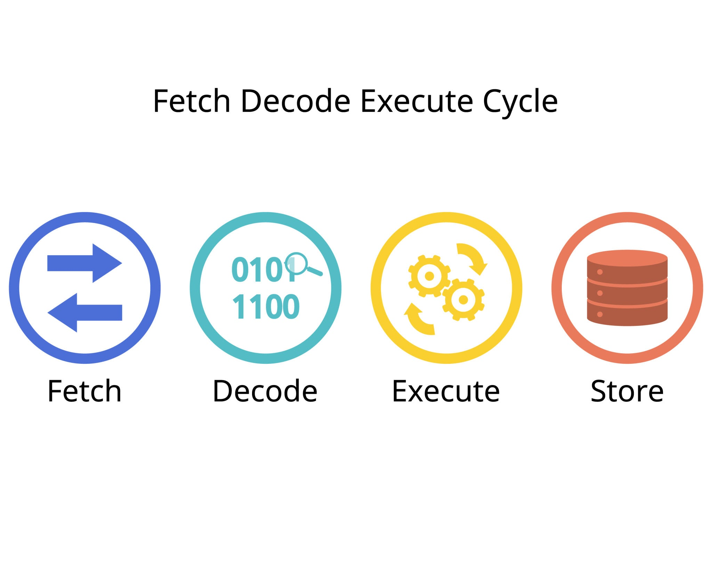

# 核心学习笔记：从 CPU 缓存到底层并发控制

## 一、 CPU 核心架构与指令执行基础

CPU 的运行是为了极致的速度，其核心组件与执行流程如下：

- **三大核心组件：**
  - **控制器（Control Unit）：** 负责流程控制与指令解码。包含程序计数器（PC，指向下一条指令）和指令寄存器（IR，存放当前指令）。
  - **运算器（ALU）：** 负责所有的算术与逻辑运算。
  - **寄存器（Register）：** CPU 内部的“私有工作台”，速度极快，所有数据必须放入寄存器才能进行运算。
- **执行流程：** 控制器从内存/缓存取指 -> 译码判断 -> ALU 从寄存器读取数据执行运算 -> 写回寄存器/缓存。
- 

------

## 二、 缓存（Cache）的读写策略

为了避免 CPU 频繁与缓慢的主内存通信，数据被映射到 CPU 缓存中。当发生写操作时，有以下两种策略：

### 1. 写直达（Write-Through）

- **机制：** 每次修改数据，既写入 Cache，也同步写入主内存。
- **优缺点：** 数据绝对同步，但频繁的内存 IO 会严重拖慢 CPU 速度。

### 2. 写回（Write-Back）—— 现代 CPU 的主流优化

- **机制：** 只要数据在缓存中命中，所有的覆写**只在缓存中进行**，绝对不和内存通信。
- **脏位（Dirty Bit）：** 当缓存中的数据被修改，但还没同步到内存时，标记为“脏（Dirty=1）”。
- **同步时机（缓存驱逐/替换）：** 只有当发生 **Cache Miss**（比如要加载新变量 b），需要腾出这块缓存空间时，CPU 才会检查旧数据（变量 a）的脏位。如果为脏，才将其写回主内存，然后加载新数据。

------

## 三、 多核 CPU 的缓存一致性（Cache Coherence）

在多核环境下，必须保证所有核心看到的数据是一致的，这主要依赖硬件层面的 **MESI 协议** 和 **总线机制**。

- **写传播（Write Propagation）：** 核心 1 修改了变量，必须让核心 2 知道。
- **写串行化（Write Serialization）：** 多个核心同时想修改同一个变量，必须排队决出先后。
- **实现机制（独占与失效）：**
  - 依靠**总线仲裁**，同一时刻只有一个核心能获得总线控制权。
  - 核心想要写数据，必须先申请**独占权（Exclusive/Modified 状态）**。
  - 获得独占权后，通过广播让其他所有核心缓存里的该数据**失效（Invalidate）**。

------

## 四、 并发 Bug 的万恶之源：寄存器与缓存的鸿沟

MESI 协议看似完美，但它**只能管缓存，管不到 CPU 的私有寄存器**。这就导致了著名的**竞态条件（Race Condition）**。

### 案例剖析：`i = i + 1` 的灾难

这个操作在底层分为三步（读-改-写）：

1. **Load (读)：** 从缓存读到寄存器。
2. **Add (算)：** 寄存器内 +1。
3. **Store (写)：** 从寄存器写回缓存。

- **漏洞所在：** 硬件为了性能，**完全放任并发读**。核心 1 和核心 2 可以瞬间同时把旧数据 `i=0` 读进自己的寄存器（脱离了 MESI 的管控）。
- **结果：** 即使最后两者的 Store (写) 操作被 MESI 协议强行排队（串行化），后写入的核心依然会用自己寄存器里的旧数据算出的结果，去覆盖前一个核心的结果，导致数据丢失（最终只加了 1 次）。

------

## 五、 锁（Lock）与原子操作的本质

为了填补上述的“读写不对等”漏洞，必须引入软件层面的**锁**或硬件层面的**原子指令**。

- **纠正误区：** 锁并不是在物理层面上限制数据“不能被同时读”。
- **锁的真正作用：** 保护一段**临界区（Critical Section）**代码。
  - 它将 `Load -> Add -> Store` 这三步强行打包成一个**不可分割的整体（原子操作）**。
  - 在核心 1 彻底完成这一整套动作并释放锁之前，直接把核心 2 挡在“读（Load）”指令之外。
  - **核心目的：** 阻止其他核心在不恰当的时机“偷看”到即将过期的旧数据。

------

这份笔记理顺了从单核提速、到多核协同、再到软件并发控制的完整逻辑链条。

在我们刚才的推导中，我们得出结论：常规的锁需要让抢不到锁的核心在门外“挂起等待”（这其实会消耗不少性能）。你是否想继续了解，现代 CPU 是如何通过一条神奇的硬件指令 **CAS（Compare-And-Swap，比较并交换）**，实现“不加锁、不排队也能保证绝对安全”的无锁编程（Lock-Free）机制的？