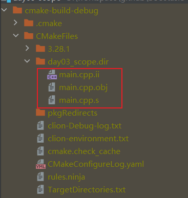

### 程序编译过程

C++程序的编译过程是一个相对复杂但有序的过程，它涉及将高级语言（C++）代码转换为机器可以执行的低级指令。在这个过程中，通常会生成几个中间文件，包括`.i`（预处理文件）、`.s`（汇编文件）和`.o`（目标文件或对象文件）。下面是这个过程的详细解释：

#### 1. 预处理（Preprocessing）

- **输入**：C++源代码文件（通常以`.cpp`或`.cxx`为后缀）。
- **处理**：预处理器（通常是`cpp`）读取源代码文件，并对其进行宏展开、条件编译、文件包含（`#include`）等处理。
- **输出**：生成预处理后的文件，通常具有`.i`后缀（尽管这个步骤可能不是所有编译器都会自动生成`.i`文件，或者可能需要特定的编译器选项来生成）。

#### 2. 编译（Compilation）

- **输入**：预处理后的文件（如果有的话，否则直接是源代码文件）。
- **处理**：编译器（如`g++`、`clang++`等）将预处理后的文件或源代码文件转换为汇编语言代码。这个步骤是编译过程的核心，它执行词法分析、语法分析、语义分析、中间代码生成、代码优化等任务。
- **输出**：生成汇编文件，通常具有`.s`或`.asm`后缀。

#### 3. 汇编（Assembly）

- **输入**：汇编文件。
- **处理**：汇编器（如`as`、`gas`等）将汇编语言代码转换为机器语言指令（即目标代码），但这些指令仍然是针对特定架构的，并且尚未被链接成可执行文件。
- **输出**：生成目标文件（或对象文件），通常具有`.o`、`.obj`或`.out`后缀。

#### 4. 链接（Linking）

- **输入**：一个或多个目标文件，以及可能需要的库文件（如C++标准库）。
- **处理**：链接器（如`ld`、`lld`等）将目标文件和库文件合并成一个可执行文件或库文件。在这个过程中，链接器会解决外部符号引用（即函数和变量的调用），并将它们链接到正确的地址。
- **输出**：生成可执行文件（在Unix-like系统中通常是`.out`、`.exe`或没有特定后缀，在Windows系统中是`.exe`）。

我们将代码的CMakeList中设置编译选项，保存临时文件

```cpp
set(CMAKE_CXX_FLAGS "${CMAKE_CXX_FLAGS} -save-temps=obj")
set(CMAKE_C_FLAGS "${CMAKE_CXX_FLAGS} -save-temps=obj")
```

点击Clion中的build，可以看到目录中生成了临时文件，包括

> .i 文件表示预处理文件
>
> `.s`（汇编文件）
>
> `.o`（目标文件或对象文件）

[](https://cdn.llfc.club/1725082193757.jpg)

#### 总结

- `.i`文件是预处理后的文件，包含了所有宏展开、条件编译和文件包含的结果。
- `.s`文件是汇编文件，包含了将C++代码转换为汇编语言后的结果。
- `.o`文件是目标文件或对象文件，包含了汇编器生成的机器语言指令，但尚未被链接成可执行文件。

这些文件在编译过程中扮演了重要的角色，帮助开发者理解和调试代码，同时也是编译链中不可或缺的一部分。不过，值得注意的是，并非所有编译器都会默认生成`.i`和`.s`文件，这可能需要特定的编译器选项来启用。


你提供的这篇笔记已经把 C++ 的编译过程总结得很准确了！框架非常清晰。为了让它**更详细、更易懂**，我们可以为每一个步骤加入**生活中的类比**以及**具体的代码变化示例**，把干瘪的理论变成生动的过程。

我们可以把 C++ 的编译过程想象成**出版一本翻译小说**的过程。

以下是为你详细展开的版本：

------

### 1. 预处理（Preprocessing）：暴力的“文本替换工”

**💡 生活类比**：在正式翻译小说之前，编辑先把你稿子里的“缩写”全部替换成全称，把你引用的“其他章节”全部复印过来贴到当前页，并把你的“个人备注”（注释）全部删掉。

在这个阶段，编译器其实还没开始真正理解你的 C++ 代码，它只是在做简单的**文本处理**。

- **处理 `#include`（文件包含）**：当你写 `#include <iostream>` 时，预处理器会找到 `iostream` 这个文件，并把里面成千上万行的代码**直接复制粘贴**到你的代码前面。
- **处理 `#define`（宏展开）**：如果你写了 `#define PI 3.14`，预处理器会在全文搜索 `PI`，并机械地把它替换成 `3.14`。
- **处理条件编译**：像 `#ifdef DEBUG` 这样的语句，预处理器会根据条件决定保留还是删掉某段代码。
- **删除注释**：你写的 `//` 和 `/* ... */` 都会在这个阶段被抹除，因为机器不需要看注释。

**变化**：从几十行的 `.cpp` 源代码，变成可能高达数万行的 `.i` 预处理文件（纯文本）。

------

### 2. 编译（Compilation）：核心的“高级翻译官”

**💡 生活类比**：正式将你的中文小说翻译成英文（这里对应汇编语言）。翻译官会检查你的语法有没有错误（拼写错误、标点漏了），并精简你的句子以提高阅读效率。

这是整个过程最复杂、最消耗时间的一步。编译器开始真正“阅读”并理解你的代码逻辑。

- **语法和语义检查**：如果你少写了一个分号 `;`，或者把字符串赋值给了整数变量，编译器会在这里报错（报错信息通常就是在这个阶段生成的）。
- **代码优化**：编译器非常聪明。如果你写了 `int a = 2 + 3;`，编译器不会让机器在运行时去算加法，而是直接优化成 `int a = 5;`。如果你写了一段永远不会执行的代码（死代码），它也会被优化掉。
- **翻译为汇编语言**：最终，C++ 高级语言会被翻译成**汇编语言（Assembly）**。汇编语言是一种人类勉强能看懂，但非常贴近底层硬件的语言（比如 `MOV`, `ADD`, `PUSH` 等指令）。

**变化**：将冗长的 `.i` 文件，翻译成了具有 `.s` 或 `.asm` 后缀的汇编文件（文本）。

------

### 3. 汇编（Assembly）：无情的“密码拍发员”

**💡 生活类比**：把翻译好的英文小说，逐字逐句转换成印刷厂机器能识别的“0和1”打孔卡片。

计算机的 CPU 是看不懂汇编语言的英文字母的，它只懂电平的高低（即二进制的 0 和 1）。

- **一对一翻译**：汇编器的工作相对简单，它几乎是一对一地将 `.s` 文件中的汇编指令（如 `ADD EAX, 1`）翻译成机器可以直接执行的机器码（如 `10000011 11000000 ...`）。
- **生成目标文件**：生成的文件不再是文本文件，而是二进制文件。如果你用记事本打开它，只会看到一堆乱码。

**变化**：由人类可读的 `.s` 汇编文件，变成了机器可读但人类无法直接阅读的 `.o`（或 `.obj`）目标文件（二进制）。**注意：此时的代码依然不能运行！**

------

### 4. 链接（Linking）：终极的“拼图组装大师”

**💡 生活类比**：小说翻译成了机器码卡片，但这只是其中一章。你还需要用到标准库里的“前言”和“附录”。装订工（链接器）把你的章节和系统自带的章节按照目录装订在一起，形成一本完整的书。

为什么 `.o` 文件还不能运行？因为缺少关键的“拼图”。

- **寻找外部函数**：你在代码里调用了 `std::cout << "Hello"`。你的 `.o` 文件里只记录了“这里需要调用 `cout`”，但 `cout` 真正的机器码实现并不在你的文件里，而在 C++ 的标准库（Library）里。
- **合并与定位**：链接器（Linker）的工作就是把你自己的 `.o` 文件、别人写好的 `.o` 文件、以及系统的库文件（如 `.lib` 或 `.a`，`.dll` 或 `.so`）打包拼接在一起。它会填补所有的“地址空白”，让程序知道去哪里找需要的函数。

**变化**：将多个独立的 `.o` 文件和库文件，融合成最终的**可执行文件**（Windows 下的 `.exe`，或 Linux/Mac 下的无后缀文件/`.out` 文件）。

------

### 关于你的 CMake 小技巧

你提到的这段 CMake 配置非常实用：

> ```
> set(CMAKE_CXX_FLAGS "${CMAKE_CXX_FLAGS} -save-temps=obj")
> ```

默认情况下，现代编译器（如 GCC 或 Clang）为了节省硬盘空间和保持目录整洁，会在后台“一口气”完成这四步，并且**悄悄删掉**中间产生的 `.i` 和 `.s` 甚至 `.o` 临时文件。

加入 `-save-temps=obj` 编译选项，就像是告诉编译器：“**请把打草稿的过程保留下来，并且和目标文件放在同一个目录下。**” 这对于学习编译原理、排查隐蔽的宏定义错误（看 `.i`）或者进行极端的性能优化（看 `.s` 里的汇编指令）有着不可替代的作用。

------

### 总结速查表

| **阶段**      | **输入文件**    | **核心动作**                   | **输出文件**    | **文件性质**         |
| ------------- | --------------- | ------------------------------ | --------------- | -------------------- |
| **1. 预处理** | `.cpp` (源代码) | 展开宏、复制头文件、删除注释   | `.i`            | 纯文本，很长         |
| **2. 编译**   | `.i`            | 语法检查、代码优化、翻译逻辑   | `.s` / `.asm`   | 纯文本，汇编指令     |
| **3. 汇编**   | `.s`            | 将汇编指令转换为机器码指令     | `.o` / `.obj`   | 二进制，不可直接执行 |
| **4. 链接**   | `.o` + 库文件   | 拼接多个目标文件，解析函数地址 | `.exe` / `.out` | 二进制，可直接执行   |

你需要我为你演示如何不使用 CMake，而是直接在终端（Terminal）中使用 GCC/Clang 命令行（如 `-E`, `-S`, `-c`）一步一步手动生成这些中间文件吗？