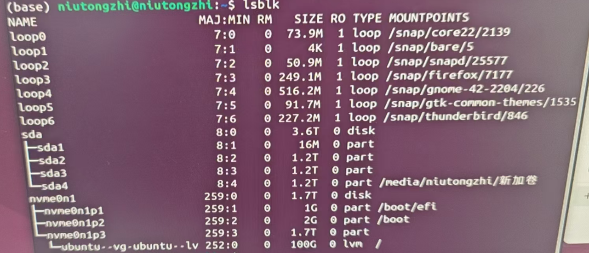
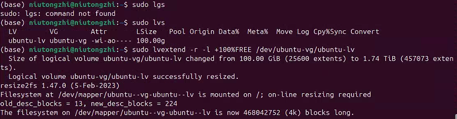
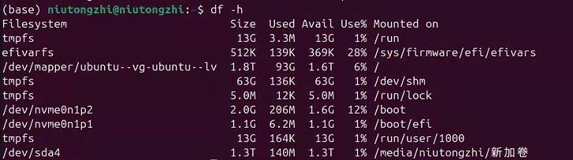
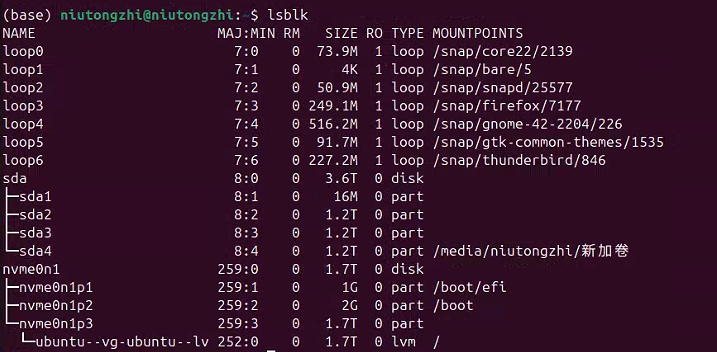
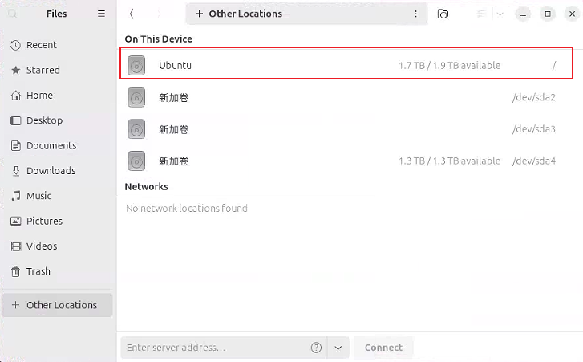

好消息：从你这张图来看，你的 Ubuntu 安装在 **LVM** 上，所以**完全可以不重装系统就扩容根分区 `/`**，而且操作比改分区安全得多。

------

## 先解释一下你现在的磁盘结构（从截图看）

关键几行：

- `nvme0n1`：1.7T 的 NVMe 硬盘
  - `nvme0n1p1` 1G   → 挂载 `/boot/efi`（EFI 分区）
  - `nvme0n1p2` 2G   → 挂载 `/boot`
  - `nvme0n1p3` 1.7T → LVM 物理卷（PV）
    - `ubuntu--vg-ubuntu--lv` 100G lvm → 挂载 `/`（根分区）

也就是说：

- 整块 1.7T 的 NVMe 都给了 LVM（`nvme0n1p3`），
- 在 LVM 里面只切了一个 100G 的逻辑卷 `ubuntu-vg/ubuntu-lv` 用来当根分区，
- **剩下 1.6T 左右的空间现在是 LVM 里的空闲空间，还没用**。

所以我们只要在 LVM 里把这个 100G 的逻辑卷扩展就行了，**不用动分区表，不用重装系统**，`/home` 也会跟着变大（因为它在 `/` 下面）。

------

## 操作思路一览

1. 查看 LVM 的空闲空间（确认确实有富余）
2. 在线扩容根逻辑卷（LV）
3. 扩展文件系统（用 `lvextend -r` 会自动帮你完成）
4. 检查结果

下面一步步来，你照着敲就行。

------

## 1. 查看卷组和空闲空间

在你现在的 Ubuntu 里打开终端，先看看 LVM 的情况：

```
sudo vgs
sudo lvs
```

大概会看到类似输出（示意）：

```
$ sudo vgs
  VG         #PV #LV #SN Attr   VSize   VFree
  ubuntu-vg    1   1   0 wz--n- 1.75t   1.65t   <-- 这里的 VFree 就是可用空间

$ sudo lvs
  LV         VG         Attr       LSize   Pool Origin Data%  Meta%  Move Log Cpy%Sync Convert
  ubuntu-lv  ubuntu-vg  -wi-ao---- 100.00g
```

确认两件事：

- 卷组名字是 `ubuntu-vg`
- 逻辑卷名字是 `ubuntu-lv`
- `VFree` 显示有几百 G～1T+ 的空闲即可

> 正常情况下跟上面示意差不多就 OK。

------

## 2. 在线扩容根逻辑卷

假设你想把根分区从 **100G 扩到 400G**（你可以换成自己想要的大小）：

> 两种写法选一种就行：

**写法 A：指定"扩到多少"**

```
sudo lvextend -r -L 400G /dev/ubuntu-vg/ubuntu-lv
```

- `-L 400G`：把这个 LV 的总大小改成 400G
- `-r`：resize filesystem，自动帮你扩展 ext4 文件系统

**写法 B：指定"增加多少"**

如果你想在原来的 100G 基础上 **增加 300G**：

```
sudo lvextend -r -L +300G /dev/ubuntu-vg/ubuntu-lv
```

> 注意：
>
> - 设备路径也可以写成 `/dev/mapper/ubuntu--vg-ubuntu--lv`，二选一都可以。
> - 命令执行过程中会有进度信息，耐心等它跑完，不要中断。

**如果你干脆想把 LVM 里所有空闲空间都给根分区：**

```
sudo lvextend -r -l +100%FREE /dev/ubuntu-vg/ubuntu-lv
```

`-l +100%FREE` 的意思是"把卷组里所有空闲都给这个 LV"。



------

## 3. 检查文件系统大小

扩容完成后，用下面命令确认 `/` 的大小：

```
df -h /
```

你应该能看到类似：

```
Filesystem                       Size  Used Avail Use% Mounted on
/dev/mapper/ubuntu--vg-ubuntu--lv 400G   XXG  XXXG  XX% /
```

只要 `Size` 变成你刚才设定的数字（比如 400G），就说明扩容成功了。
 这时 `/home` 也自动享受这块更大的空间了，因为它就是 `/` 里面的普通目录。







------

## 4. 需要不要单独搞一个 `/home` 分区？

从结构上讲，现在根分区已经扩到你想要的大小，其实就够用了；
 如果你今后想做备份 / 重装更方便，也可以另外在 LVM 里再建一个逻辑卷挂到 `/home`，再把数据搬过去（那是另一个方案，随时可以再帮你写步骤）。

------

## 风险 & 建议

- LVM 扩容比改分区安全很多，但 **重要数据（尤其 /home）最好先备份一份到机械盘 `sda` 或移动硬盘**，以防万一。
- 执行 `lvextend` 的时候保证不断电、不要强制重启。
- 整个过程不需要进 LiveUSB，也不需要卸载根分区。
