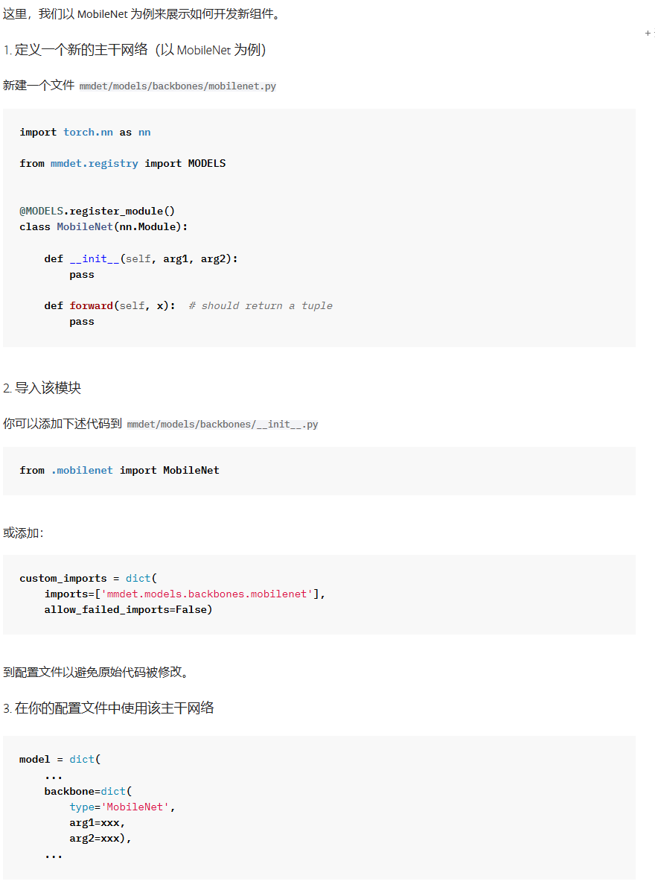

# 问题

即便是上传代码且运行一下指令安装后：

```bash
pip install --no-build-isolation . --force-reinstall --no-deps
```

也报错：

KeyError: 'YOLA_Transformer is not in the mmdet::model registry. Please check whether the value of `YOLA_Transformer` is correct or it was registered as expected. More details can be found at https://mmengine.readthedocs.io/en/latest/advanced_tutorials/config.html#import-the-custom-module'



# 解决方案

```
在配置文件添加 MMDetection 官方推荐的 custom_imports，而不修改mmdet：
  # 自定义模块导入（MMDetection 官方推荐方式）
  custom_imports = dict(
      imports=['mmdet.models.detectors.yola_wavelet'],
      allow_failed_imports=False
  )
```


# 参考链接

## [MMDetection官方文档](https://mmdetection.cn/en/latest/get_started.html)

### [自定义模型与配置文件](https://mmdetection.readthedocs.io/zh-cn/latest/advanced_guides)
