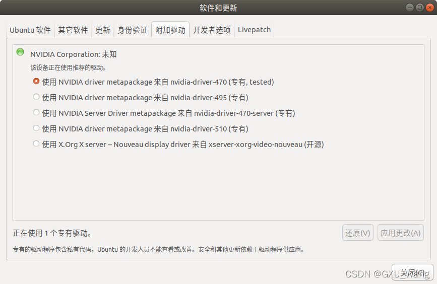
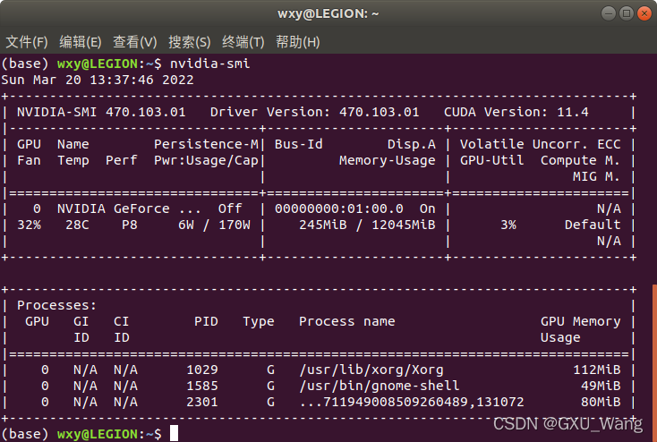
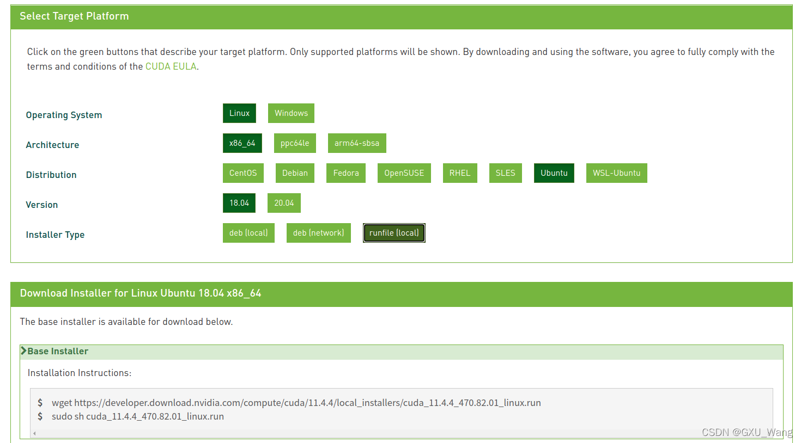
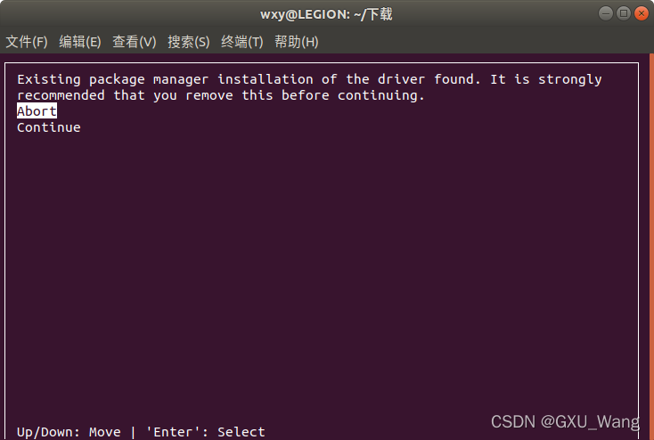
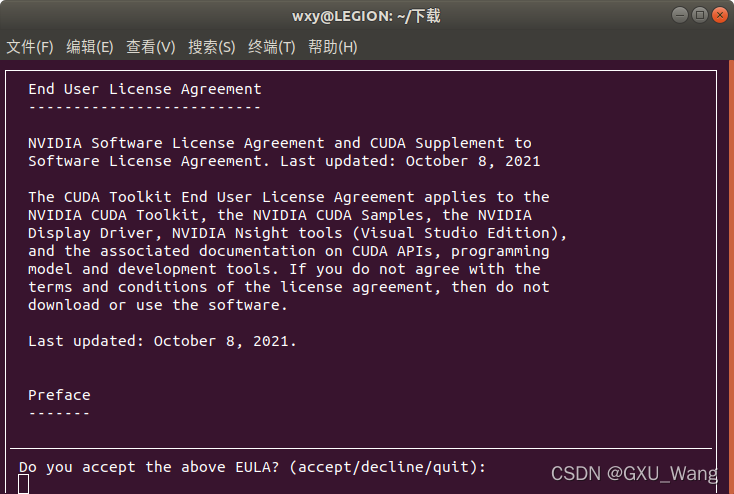
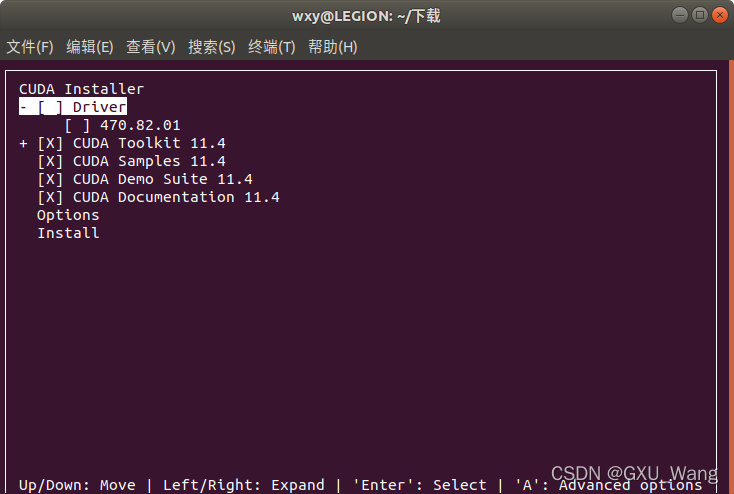
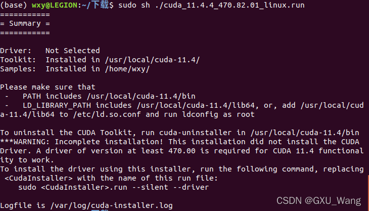
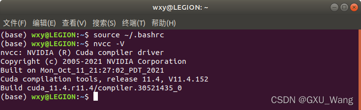

# 一、CUDA配置

进入 https://developer.nvidia.com/cuda-toolkit-archive

选择cuda12.1，手动下载，之后执行

```bash
chmod +x cuda_12.1.0_530.30.02_linux.run
sudo ./cuda_12.1.0_530.30.02_linux.run --installpath=/mnt/xxg/RoboTwin/cuda/cuda-12.1
```

安装完成后，需要配置临时环境变量，

```
export PATH=/mnt/xxg/RoboTwin/cuda/cuda-12.1/bin:$PATH

export LD_LIBRARY_PATH=/mnt/xxg/RoboTwin/cuda/cuda-12.1/lib64:$LD_LIBRARY_PATH
```

# 一、显卡驱动安装

### 1.1、安装nvidia-cuda-toolkit 工具

```bash
sudo apt-get install nvidia-cuda-toolkit
```

### 1.2、检查系统推荐显卡驱动，记录下recommend选项

```bash
sudo ubuntu-drivers devices
```

结果显示如下：

```bash
== /sys/devices/pci0000:00/0000:00:01.0/0000:01:00.0 ==
modalias : pci:v000010DEd000028E0sv0000103Csd00008BABbc03sc00i00
vendor   : NVIDIA Corporation
driver   : nvidia-driver-535-open - distro non-free
driver   : nvidia-driver-535-server-open - distro non-free
driver   : nvidia-driver-535 - distro non-free recommended #记下推荐版本
driver   : nvidia-driver-525-server - distro non-free
driver   : nvidia-driver-535-server - distro non-free
driver   : nvidia-driver-525 - distro non-free
driver   : nvidia-driver-525-open - distro non-free
driver   : xserver-xorg-video-nouveau - distro free builtin
```

### 1.3、添加驱动源

```bash
sudo add-apt-repository ppa:graphics-drivers/ppa
sudo apt-get update
```

### 1.4、在Ubuntu系统中找到 软件和更新 选择 驱动



这里选择刚才记下的系统推荐的版本就好。不要选择带server的，那是服务器版本。

### 1.5、重启电脑

```bash
reboot
```

1.6、查看驱动版本

```bash
nvidia-smi
```



注意：这里的CUDA版本是系统推荐的，并不是自己安装的

# 二、安装CUDA

## **安装前的准备 (至关重要)**

- 安装依赖

  : 确保编译环境和内核头文件已安装。

  ```bash
  sudo apt-get update
  sudo apt-get install build-essential dkms linux-headers-$(uname -r)
  ```

- 禁用 Nouveau 开源驱动

  : Nouveau 驱动与 NVIDIA 官方驱动冲突，必须禁用。

  a. 创建一个新的 modprobe 配置文件：

  ```bash
  sudo nano /etc/modprobe.d/blacklist-nouveau.conf
  ```

  b. 在文件中添加以下内容：

  ```
  blacklist nouveau
  options nouveau modeset=0
  ```

  c. 保存并退出 (Ctrl+X, Y, Enter)。

  d. 更新内核 initramfs 并重启：

  ```bash
  sudo update-initramfs -u
  sudo reboot
  ```

  e. 重启后，验证 Nouveau 是否已禁用 (该命令应无任何输出)：

  ```bash
  lsmod | grep nouveau
  ```

## 官网下载cuda软件包

点击  https://developer.nvidia.com/cuda-toolkit-archive



```bash
wget
https://developer.download.nvidia.com/compute/cuda/11.4.4/local_installers/cuda_11.4.4_470.82.01_linux.run
```

## 安装

```bash
sudo sh cuda_11.4.4_470.82.01_linux.run
```



这里选择continue继续就好（这里我想的是要是之前没有安装显卡驱动的话，在这里安装的显卡驱动重启后会不会黑屏）



这里输入accept继续



这里因为我安装过显卡驱动了，我就没有安装第一项了，不知道如果这里安装了会怎么样，有哪位时间可以试一试。



 最后会显示安装报告。

### 环境配置

```bash
sudo vim ~/.bashrc
```

 在文末添加以下信息

```bash
# 1. CUDA 根目录（注意这里没有 /bin）
export CUDA_HOME=/usr/local/cuda-12.8

# 2. 动态库路径
export LD_LIBRARY_PATH=$CUDA_HOME/lib64:$CUDA_HOME/extras/CUPTI/lib64:$LD_LIBRARY_PATH

# 3. 把 nvcc 所在目录加入 PATH
export PATH=$CUDA_HOME/bin:$PATH
```

验证cuda安装是否成功：关闭当前命令行，并执行

```bash
source ~/.bashrc
nvcc -V
```



## 卸载

Linux 上的卸载和安装更依赖命令行，但也更加灵活。我们将主要介绍使用 `.run` 文件进行安装的方法，因为它提供了最大的控制权。

#### **步骤一：彻底卸载 (The Thorough Cleanse)**

根据你当初的安装方式，选择对应的卸载方法。

- **方法A：如果使用官方 `.run` 文件安装**

  - NVIDIA 提供了一个卸载脚本。找到你的 CUDA 安装目录（默认为/usr/local/cuda-X.Y），在其bin目录下执行：

    ```bash
    sudo /usr/local/cuda-X.Y/bin/cuda-uninstaller
    ```

  - 按照终端中的提示完成卸载。

- **方法B：如果使用包管理器 (`.deb` / `.rpm`) 安装**

  - 这是最干净的卸载方式。使用以下命令可以清除所有与 cuda 和 nvidia 相关的包：

    ```bash
    sudo apt-get --purge remove "*cublas*" "*cufft*" "*curand*" "*cusolver*" "*cusparse*" "*npp*" "*nvjpeg*" "cuda*" "nsight*"
    sudo apt-get --purge remove "*nvidia*"
    sudo apt-get autoremove
    sudo apt-get autoclean
    sudo rm -rf /usr/local/cuda*
    ```

    这个命令会利用通配符匹配并彻底删除所有相关包及其配置文件。

- **手动清理残留**
  无论使用哪种方法，都建议进行手动检查：

  1. 删除安装目录: `sudo rm -rf /usr/local/cuda*`

  2. 清理环境变量

     编辑你的 shell 配置文件（如~/.bashrc, ~/.zshrc），删除所有与 CUDA 相关的行，例如：

     ```bash
     #
     # export PATH=/usr/local/cuda-X.Y/bin${PATH:+:${PATH}}
     # export LD_LIBRARY_PATH=/usr/local/cuda-X.Y/lib64${LD_LIBRARY_PATH:+:${LD_LIBRARY_PATH}}
     #
     ```

     保存文件后，执行

     ```bash
     source ~/.bashrc
     ```

     (或相应的配置文件) 使其生效。

**最后重启**
`sudo reboot` 以确保所有内核模块和系统服务都已重置。

# 三、服务器后台训练

nohup bash collect_data.sh stack_blocks_two demo_point 1 > /home/myf/RoboTwin/Log/output.log 2>&1 &

```
-- 3359083
```

通过 `kill` 命令来终止进程：

```
kill 3359083
```

可以通过以下命令来检查进程是否已经停止：

```
ps -p 3359083
```
