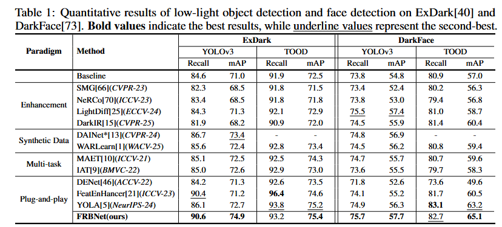
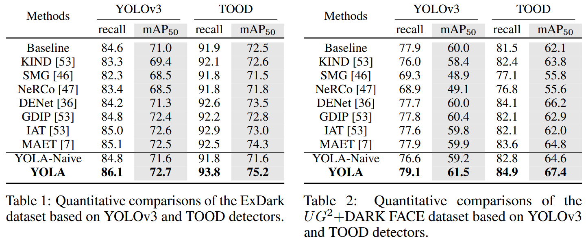

# 指标

## FRBNet



| **Paradigm**       | **Method**                   | **ExDark(YOLOv3)Recall** | **ExDark(YOLOv3)mAP** | **ExDark(TOOD)Recall** | **ExDark(TOOD)mAP** | **DarkFace(YOLOv3)Recall** | **DarkFace(YOLOv3)mAP** | **DarkFace(TOOD)Recall** | **DarkFace(TOOD)mAP** |
| ------------------ | ---------------------------- | ------------------------ | --------------------- | ---------------------- | ------------------- | -------------------------- | ----------------------- | ------------------------ | --------------------- |
|                    | Baseline                     | 84.6                     | 71.0                  | 91.9                   | 72.5                | 73.8                       | 54.8                    | 80.9                     | 57.0                  |
| **Enhancement**    | SMG[66] *(CVPR-23)*          | 82.3                     | 68.5                  | 91.8                   | 71.5                | 73.4                       | 52.4                    | 80.2                     | 56.3                  |
|                    | NeRCo[70] *(ICCV-23)*        | 83.4                     | 68.5                  | 91.8                   | 71.8                | 73.8                       | 53.0                    | 79.4                     | 56.8                  |
|                    | LightDiff[25] *(ECCV-24)*    | 84.3                     | 71.3                  | 92.1                   | 72.9                | <u>75.5</u>                | <u>57.4</u>             | 81.0                     | 58.7                  |
|                    | DarkIR[15] *(CVPR-25)*       | 81.9                     | 68.2                  | 90.9                   | 72.0                | 74.5                       | 55.9                    | 81.4                     | 60.4                  |
| **Synthetic Data** | DAINet*[13] *(CVPR-24)*      | 86.7                     | <u>73.4</u>           | -                      | -                   | 74.8                       | 56.9                    | -                        | -                     |
|                    | WARLearn[1] *(WACV-25)*      | 85.6                     | 72.4                  | 92.8                   | 73.4                | 74.5                       | 56.2                    | 80.8                     | 59.4                  |
| **Multi-task**     | MAET[10] *(ICCV-21)*         | 85.1                     | 72.5                  | 92.5                   | 74.3                | 74.7                       | 55.7                    | 80.7                     | 59.6                  |
|                    | IAT[9] *(BMVC-22)*           | 85.0                     | 72.6                  | 92.9                   | 73.0                | 73.6                       | 55.5                    | 79.7                     | 58.3                  |
| **Plug-and-play**  | DENet[46] *(ACCV-22)*        | 84.2                     | 71.3                  | 92.6                   | 73.5                | 71.8                       | 52.6                    | 73.6                     | 49.6                  |
|                    | FeatEnHancer[21] *(ICCV-23)* | <u>90.4</u>              | 71.2                  | **96.4**               | 74.6                | 74.1                       | 55.2                    | 81.7                     | 60.5                  |
|                    | YOLA[5] *(NeurIPS-24)*       | 86.1                     | 72.7                  | <u>93.8</u>            | <u>75.2</u>         | 74.9                       | 56.3                    | **83.1**                 | <u>63.2</u>           |
|                    | **FRBNet(NeurIPS-25)**       | **90.6**                 | **74.9**              | 93.2                   | **75.4**            | **75.7**                   | **57.7**                | <u>82.7</u>              | **65.1**              |

上图是FRBNet中的指标

下面我跑出来的测试指标，比论文图降低了0.2个百分点

#### yolov3-只开源了yolov3代码，tood怕补充错，不补充

| **class** | **gts** | **dets** | **recall** | **ap**    |
| --------- | ------- | -------- | ---------- | --------- |
| Bicycle   | 418     | 1353     | 0.902      | 0.834     |
| Boat      | 515     | 1607     | 0.874      | 0.756     |
| Bottle    | 433     | 2021     | 0.850      | 0.750     |
| Bus       | 164     | 572      | 0.951      | 0.886     |
| Car       | 919     | 2845     | 0.922      | 0.827     |
| Cat       | 425     | 1150     | 0.845      | 0.695     |
| Chair     | 609     | 3678     | 0.857      | 0.711     |
| Cup       | 356     | 1697     | 0.860      | 0.724     |
| Dog       | 490     | 1498     | 0.931      | 0.832     |
| Motorbike | 242     | 1351     | 0.822      | 0.669     |
| People    | 2235    | 7391     | 0.894      | 0.804     |
| Table     | 311     | 2926     | 0.823      | 0.483     |
| **mAP**   |         |          |            | **0.747** |


## YOLA



### Exdark-iou_thr:0.5

#### TOOD

| 类别 | GT数量 | 检测数量 | Recall | AP |
|------|--------|----------|--------|----|
| Bicycle | 418 | 3584 | 0.933 | 0.833 |
| Boat | 515 | 5438 | 0.940 | 0.785 |
| Bottle | 433 | 5793 | 0.891 | 0.742 |
| Bus | 164 | 2042 | 0.957 | 0.888 |
| Car | 919 | 9011 | 0.933 | 0.794 |
| Cat | 425 | 3733 | 0.908 | 0.749 |
| Chair | 609 | 10100 | 0.893 | 0.706 |
| Cup | 356 | 5269 | 0.899 | 0.722 |
| Dog | 490 | 4176 | 0.963 | 0.862 |
| Motorbike | 242 | 5374 | 0.905 | 0.633 |
| People | 2235 | 20178 | 0.905 | 0.778 |
| Table | 311 | 8944 | 0.884 | 0.495 |
| **mRecall** | | | **0.918** | |
| **mAP** | | | | **0.749**↓ |

#### yolov3

| 类别 | GT数量 | 检测数量 | Recall | AP |
|------|--------|----------|--------|----|
| Bicycle | 418 | 1159 | 0.895 | 0.832 |
| Boat | 515 | 1275 | 0.860 | 0.770 |
| Bottle | 433 | 1404 | 0.818 | 0.726 |
| Bus | 164 | 446 | 0.939 | 0.881 |
| Car | 919 | 2327 | 0.890 | 0.816 |
| Cat | 425 | 1407 | 0.845 | 0.685 |
| Chair | 609 | 2648 | 0.788 | 0.668 |
| Cup | 356 | 1201 | 0.820 | 0.699 |
| Dog | 490 | 1345 | 0.906 | 0.801 |
| Motorbike | 242 | 1182 | 0.798 | 0.638 |
| People | 2235 | 6357 | 0.868 | 0.778 |
| Table | 311 | 2123 | 0.807 | 0.494 |
| **mRecall** | | | **0.853** | |
| **mAP** | | | | **0.732**↑ |

降点（得靠大batchsize来增点，点数也没之前高，离谱，之前不知道改啥了）

#### baseline

| **class** | **gts** | **dets** | **recall** | **ap**    |
| --------- | ------- | -------- | ---------- | --------- |
| Bicycle   | 418     | 1311     | 0.866      | 0.801     |
| Boat      | 515     | 1221     | 0.817      | 0.722     |
| Bottle    | 433     | 1382     | 0.813      | 0.724     |
| Bus       | 164     | 511      | 0.909      | 0.848     |
| Car       | 919     | 2429     | 0.862      | 0.783     |
| Cat       | 425     | 1348     | 0.831      | 0.669     |
| Chair     | 609     | 2970     | 0.772      | 0.651     |
| Cup       | 356     | 1084     | 0.831      | 0.711     |
| Dog       | 490     | 1296     | 0.898      | 0.786     |
| Motorbike | 242     | 1435     | 0.826      | 0.641     |
| People    | 2235    | 6152     | 0.858      | 0.768     |
| Table     | 311     | 2079     | 0.746      | 0.494     |
| **mAP**   |         |          |            | **0.717** |

### DarkFace-iou_thr:0.5

#### TOOD（逆天成绩，之前没跑出来过，莫名其妙）

| 类别 | GT数量 | 检测数量 | Recall | AP |
|------|--------|----------|--------|----|
| Face | 4205 | 49304 | 0.868 | 0.711 |
| **mRecall** | | | **0.868** | |
| **mAP** | | | | **0.711** |

#### yolov3

| **class** | **gts** | **dets** | **recall** | **ap**     |
| --------- | ------- | -------- | ---------- | ---------- |
| Face      | 4205    | 22115    | 0.788      | 0.605      |
| **mAP**   |         |          |            | **0.605**↓ |


## OURS

### Exdark-iou_thr:0.5

#### TOOD

| 类别        | GT数量 | 检测数量 | Recall    | AP         |
| ----------- | ------ | -------- | --------- | ---------- |
| Bicycle     | 418    | 3397     | 0.933     | 0.843      |
| Boat        | 515    | 5705     | 0.932     | 0.797      |
| Bottle      | 433    | 5247     | 0.880     | 0.739      |
| Bus         | 164    | 2094     | 0.957     | 0.887      |
| Car         | 919    | 8203     | 0.938     | 0.801      |
| Cat         | 425    | 3743     | 0.882     | 0.731      |
| Chair       | 609    | 10632    | 0.892     | 0.698      |
| Cup         | 356    | 5009     | 0.907     | 0.708      |
| Dog         | 490    | 3953     | 0.973     | 0.880      |
| Motorbike   | 242    | 4965     | 0.905     | 0.645      |
| People      | 2235   | 21588    | 0.912     | 0.779      |
| Table       | 311    | 8723     | 0.904     | 0.509      |
| **mRecall** |        |          | **0.918** |            |
| **mAP**     |        |          |           | **0.751**↑ |

#### yolov3

| 类别 | GT数量 | 检测数量 | Recall | AP |
|------|--------|----------|--------|----|
| Bicycle | 418 | 1160 | 0.892 | 0.829 |
| Boat | 515 | 1264 | 0.835 | 0.752 |
| Bottle | 433 | 1483 | 0.804 | 0.706 |
| Bus | 164 | 459 | 0.933 | 0.878 |
| Car | 919 | 2169 | 0.884 | 0.799 |
| Cat | 425 | 1367 | 0.842 | 0.678 |
| Chair | 609 | 2745 | 0.782 | 0.660 |
| Cup | 356 | 1175 | 0.840 | 0.703 |
| Dog | 490 | 1403 | 0.902 | 0.794 |
| Motorbike | 242 | 1123 | 0.835 | 0.672 |
| People | 2235 | 6184 | 0.872 | 0.783 |
| Table | 311 | 2147 | 0.775 | 0.492 |
| **mRecall** | | | **0.850** | |
| **mAP** | | | | **0.729**↓ |


### DarkFace-iou_thr:0.5

#### TOOD

| 类别 | GT数量 | 检测数量 | Recall | AP |
|------|--------|----------|--------|----|
| Face | 4205 | 49120 | 0.870 | 0.715 |
| **mRecall** | | | **0.870** | |
| **mAP** | | | | **0.715**↑ |

#### yolov3

| 类别 | GT数量 | 检测数量 | Recall | AP |
|------|--------|----------|--------|----|
| Face | 4205 | 21860 | 0.796 | 0.622 |
| **mRecall** | | | **0.796** | |
| **mAP** | | | | **0.622** |


### Ablation

#### TOOD

##### yola_hfe_exdark_ablation1_reflected_only

| 类别 | GT数量 | 检测数量 | Recall | AP |
|------|--------|----------|--------|----|
| Bicycle | 418 | 3330 | 0.935 | 0.837 |
| Boat | 515 | 5060 | 0.936 | 0.788 |
| Bottle | 433 | 5127 | 0.880 | 0.732 |
| Bus | 164 | 2179 | 0.976 | 0.892 |
| Car | 919 | 9108 | 0.936 | 0.795 |
| Cat | 425 | 3613 | 0.904 | 0.731 |
| Chair | 609 | 9965 | 0.883 | 0.700 |
| Cup | 356 | 5064 | 0.902 | 0.705 |
| Dog | 490 | 4143 | 0.963 | 0.871 |
| Motorbike | 242 | 5237 | 0.926 | 0.660 |
| People | 2235 | 20509 | 0.908 | 0.782 |
| Table | 311 | 9362 | 0.897 | 0.506 |
| **mRecall** | | | **0.920** | |
| **mAP** | | | | **0.750**↑ |


##### work_dirs/yola_hfe_exdark_ablation2_plus_frequency

| 类别 | GT数量 | 检测数量 | Recall | AP |
|------|--------|----------|--------|----|
| Bicycle | 418 | 3408 | 0.933 | 0.833 |
| Boat | 515 | 5927 | 0.940 | 0.784 |
| Bottle | 433 | 5877 | 0.871 | 0.729 |
| Bus | 164 | 2023 | 0.963 | 0.879 |
| Car | 919 | 8669 | 0.936 | 0.796 |
| Cat | 425 | 4003 | 0.892 | 0.748 |
| Chair | 609 | 10884 | 0.901 | 0.708 |
| Cup | 356 | 5210 | 0.910 | 0.718 |
| Dog | 490 | 4219 | 0.967 | 0.876 |
| Motorbike | 242 | 4970 | 0.905 | 0.627 |
| People | 2235 | 21489 | 0.908 | 0.778 |
| Table | 311 | 8564 | 0.897 | 0.511 |
| **mRecall** | | | **0.919** | |
| **mAP** | | | | **0.749**= |


##### yola_hfe_exdark_ablation3_plus_wavelet

| 类别 | GT数量 | 检测数量 | Recall | AP |
|------|--------|----------|--------|----|
| Bicycle | 418 | 3475 | 0.940 | 0.835 |
| Boat | 515 | 6092 | 0.938 | 0.785 |
| Bottle | 433 | 5430 | 0.887 | 0.738 |
| Bus | 164 | 2100 | 0.951 | 0.887 |
| Car | 919 | 8787 | 0.930 | 0.793 |
| Cat | 425 | 3892 | 0.896 | 0.747 |
| Chair | 609 | 10453 | 0.901 | 0.706 |
| Cup | 356 | 5225 | 0.904 | 0.715 |
| Dog | 490 | 4098 | 0.969 | 0.880 |
| Motorbike | 242 | 4978 | 0.921 | 0.644 |
| People | 2235 | 20963 | 0.906 | 0.778 |
| Table | 311 | 8572 | 0.900 | 0.512 |
| **mRecall** | | | **0.920** | |
| **mAP** | | | | **0.752**↑ |


##### yola_hfe_exdark_ablation4_three_branches_no_attn

| 类别 | GT数量 | 检测数量 | Recall | AP |
|------|--------|----------|--------|----|
| Bicycle | 418 | 3255 | 0.928 | 0.831 |
| Boat | 515 | 5958 | 0.930 | 0.784 |
| Bottle | 433 | 5981 | 0.882 | 0.749 |
| Bus | 164 | 2169 | 0.970 | 0.890 |
| Car | 919 | 8849 | 0.937 | 0.805 |
| Cat | 425 | 3797 | 0.906 | 0.747 |
| Chair | 609 | 10142 | 0.901 | 0.699 |
| Cup | 356 | 5254 | 0.904 | 0.731 |
| Dog | 490 | 4136 | 0.971 | 0.876 |
| Motorbike | 242 | 5134 | 0.921 | 0.634 |
| People | 2235 | 21825 | 0.914 | 0.782 |
| Table | 311 | 8585 | 0.900 | 0.492 |
| **mRecall** | | | **0.922** | |
| **mAP** | | | | **0.752**↑ |


##### yola_hfe_exdark_ablation5_reflected_with_attn

| 类别 | GT数量 | 检测数量 | Recall | AP |
|------|--------|----------|--------|----|
| Bicycle | 418 | 3339 | 0.931 | 0.837 |
| Boat | 515 | 5855 | 0.942 | 0.779 |
| Bottle | 433 | 5389 | 0.873 | 0.741 |
| Bus | 164 | 2110 | 0.951 | 0.892 |
| Car | 919 | 9019 | 0.941 | 0.793 |
| Cat | 425 | 3747 | 0.904 | 0.759 |
| Chair | 609 | 10270 | 0.895 | 0.706 |
| Cup | 356 | 5178 | 0.902 | 0.714 |
| Dog | 490 | 3961 | 0.965 | 0.872 |
| Motorbike | 242 | 4855 | 0.926 | 0.646 |
| People | 2235 | 20443 | 0.910 | 0.779 |
| Table | 311 | 8296 | 0.897 | 0.501 |
| **mRecall** | | | **0.920** | |
| **mAP** | | | | **0.752**↑ |


# 新思路

## 路由融合

只使用yola原始的卷积融合融合多分支特征不能很好的根据样本做出分支特征的取舍，因此加入MoE的路由机制

### 使用mlp路由

把两个分支的特征分别池化降采样然后展平成48维输入给mlp，输出为二维向量，分别对应分支权重，下面是yolov3的表现，和yola比降低了0.1个百分点

| 类别        | GT数量 | 检测数量 | Recall    | AP         |
| ----------- | ------ | -------- | --------- | ---------- |
| Bicycle     | 418    | 1123     | 0.880     | 0.824      |
| Boat        | 515    | 1234     | 0.841     | 0.746      |
| Bottle      | 433    | 1499     | 0.827     | 0.734      |
| Bus         | 164    | 443      | 0.933     | 0.881      |
| Car         | 919    | 2369     | 0.885     | 0.813      |
| Cat         | 425    | 1185     | 0.828     | 0.681      |
| Chair       | 609    | 2585     | 0.796     | 0.686      |
| Cup         | 356    | 1217     | 0.840     | 0.714      |
| Dog         | 490    | 1306     | 0.914     | 0.809      |
| Motorbike   | 242    | 1104     | 0.793     | 0.637      |
| People      | 2235   | 6274     | 0.867     | 0.782      |
| Table       | 311    | 2126     | 0.772     | 0.467      |
| **mRecall** |        |          | **0.848** |            |
| **mAP**     |        |          |           | **0.731**↓ |


### 卷积做空间上的路由

上面感觉$B*24*608*608$到$B*48$作为路由输入信息损失太多，想着用卷积做$B*branchnums*608*608$的路由，而且感觉只利用分支的特征信息做路由感觉不够有依据，按道理还要看原材料是怎么样的然后决定选择什么特征，因此就融入了$RGB:B*24*608*608$的特征作为路由输入。

```python
        # 3x3 卷积生成空间权重图
        # 输入: (B, 48/72, H, W) → 输出: (B, 2, H, W)
        self.router_conv = nn.Conv2d(
            actual_in_channels,
            num_experts,
            kernel_size=kernel_size,
            padding=padding,
            bias=True
        )
```

还是降点了，不多

| 类别        | GT数量 | 检测数量 | Recall    | AP         |
| ----------- | ------ | -------- | --------- | ---------- |
| Bicycle     | 418    | 1135     | 0.885     | 0.822      |
| Boat        | 515    | 1196     | 0.839     | 0.748      |
| Bottle      | 433    | 1608     | 0.801     | 0.709      |
| Bus         | 164    | 434      | 0.927     | 0.876      |
| Car         | 919    | 2149     | 0.882     | 0.808      |
| Cat         | 425    | 1300     | 0.833     | 0.676      |
| Chair       | 609    | 2589     | 0.782     | 0.659      |
| Cup         | 356    | 1194     | 0.860     | 0.722      |
| Dog         | 490    | 1357     | 0.914     | 0.783      |
| Motorbike   | 242    | 1070     | 0.806     | 0.647      |
| People      | 2235   | 6482     | 0.864     | 0.771      |
| Table       | 311    | 2070     | 0.746     | 0.474      |
| **mRecall** |        |          | **0.845** |            |
| **mAP**     |        |          |           | **0.725**↓ |
