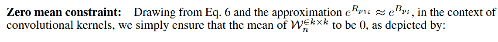

## YOLA

朗伯假设:根据双色反射模型的体反射项, $C_{p_i}$的值可用离散形式表示为:
$$
C_{p_i}=m(\vec{n}_{p_i},\vec{l}_{p_i})e^{C_{p_i}}(\lambda)\rho^{C_{p_i}}(\lambda)
$$
交叉颜色比率:考虑两个相邻像素,分别表示为$p_{1}$ 和$p_{2}$,以及红色$(R)$和蓝色$(B)$通道,我 们可以通过以下计算步骤确定红蓝通道之间的比率$M_{rb}$ :
$$
M_{rb}=\frac{R_{p_1}B_{p_2}}{R_{p_2}B_{p_1}}
$$
对 $M_{rb}$ 取对数并用公式$C_{p_i}=m(\vec{n}_{p_i},\vec{l}_{p_i})e^{C_{p_i}}(\lambda)\rho^{C_{p_i}}(\lambda)$替换像素值后,我们得到:
$$
\begin{aligned}\begin{aligned}log(M_{rb})=log(m(\vec{n_{p_1}},\vec{l_{p_1}}))-log(m(\vec{n_{p_1}},\vec{l_{p_1}}))\end{aligned}\\+log(e^{R_{\boldsymbol{p}_1}}(\lambda))-log(e^{R_{\boldsymbol{p}_2}}(\lambda))\\+log(\rho^{R_{\boldsymbol{\underset{1}{p}}}}(\lambda))-log(\rho^{R_{\boldsymbol{\underset{2}{p}}}}(\lambda))\\+log(m(\vec{n_{p_2}},\vec{l_{p_2}}))-log(m(\vec{n_{p_2}},\vec{l_{p_2}}))\\+log(e^{B_{\boldsymbol{p}_2}}(\lambda))-log(e^{B_{\boldsymbol{p}_1}}(\lambda))\\+log(\rho^{B_{p_2}}(\lambda))-log(\rho^{B_{p_1}}(\lambda))\end{aligned}
$$
基于$e^{C_{p_1}}\approx e^{C_{p_2}}$的光照假设,上述方程可进一步简化为光照不变形式:

$$
\begin{aligned}log(M_{rb})&=log(\rho^{R_{p_1}}(\lambda))-log(\rho^{R_{p_2}}(\lambda))\\&+log(\rho^{B_{p_2}}(\lambda))-log(\rho^{B_{p_1}}(\lambda))\end{aligned}
$$
可学习核。目标是将固定的光照不变特征转化为可学习形式。具体而言,我们旨在学习一  组卷积核$\mathcal{W}_1,\mathcal{W}_2,\cdots\mathcal{W}_n^{\in k\times k}$ ,其中$n$表示核的数量, $k$表示核大小。此处,我们将固定特 征扩展为更具通用性和泛化性的形式。设$p_{i}$和$w_{i}$表示核$\mathcal{W}_{n}$内的一组像素位置及其对应权 重,其中$i=0,1,\cdots k^2$。这些参数使我们能够将交叉颜色比率 (CCR) 演变为可适应形式, 从而提升其有效处理不同光照条件的能力。请注意$w_{i}$是可训练的,这使得正负极性变得无关紧要
$$
M_{rb}=\prod_{\binom{i,j=1}{i\neq j}}^{k^2}\left(\frac{R_{p_i}}{B_{p_i}}\right)^{w_i}\left(\frac{B_{p_j}}{R_{p_j}}\right)^{w_j}
$$
为使扩展形式仍满足光照不变性, $M_{rb}$的对数需满足以下约束条件:
$$
\begin{cases}\sum_i^{k^2}w_ilog(e^{R_{p_i}}(\lambda))=0\\\sum_i^{k^2}w_ilog(e^{B_{p_i}}(\lambda))=0&&\end{cases}
$$
如果上述等式成立，e 项和 m 项将被消除。最终特征可以用以下广义形式表示：
$$
\log(M_{rb})=\sum_i^{k^2}w_i\log(\rho^{R_{p_i}}\left(\lambda\right))-\sum_i^{k^2}w_i\log(\rho^{B_{p_i}}\left(\lambda\right))
$$
将核 $\mathcal{W}_i$ 应用于图像 $I$ 所得到的特征，记为 $f_{\mathcal{W}_i}(I)$，可以表示为：
$$
f_{\mathcal{W}_i}(I)=\left[\begin{array}{c}\mathcal{W}_i\circledast \log(R)+(-\mathcal{W}_i)\circledast \log(B)\\\mathcal{W}_i\circledast \log(R)+(-\mathcal{W}_i)\circledast \log(G)\\\mathcal{W}_i\circledast \log(G)+(-\mathcal{W}_i)\circledast \log(B)\end{array}\right]
$$
**零均值约束（Zero mean constraint）**：根据公式 $\begin{cases}\sum_i^{k^2}w_i\log(e^{R_{p_i}}(\lambda))=0\\\sum_i^{k^2}w_i\log(e^{B_{p_i}}(\lambda))=0&&\end{cases}$ 以及近似 $e^{R_{p_{i}}}\approx e^{B_{p_{i}}}$，在卷积核的语境下，我们只需确保 $\mathcal{W}_n^{\in k\times k}$ 的均值为 0，如下所示：
$$
\overline{\mathcal{W}_n}=\frac{1}{k^2}\sum_{i=1}^{k^2}w_i=0
$$

## FRBNet

受 Phong 光照模型中加性分解（additive decomposition）的启发，我们引入了一种适应真实低光场景的朗伯模型（Lambertian model）扩展版本。我们将局部光源重新解释为非均匀高光，其表示如下：
$$
I_C(x, y) = m[\vec{n}(x, y), \vec{l}(x, y)] \cdot \varphi_C(x, y) \cdot \rho_C(x, y) + S_C(x, y), \tag{2}
$$
其中 $S_C$ 代表空间不规则的高光分量，可进一步定义为：
$$
S_C(x, y) = H_C(x, y) \cdot m[\vec{n}(x, y), \vec{l}(x, y)] \cdot \varphi_C(x, y) \cdot \rho_C(x, y), \tag{3}
$$
这里 $H_C$ 表示高光干扰的相对强度。为简化符号，我们定义 $D_C(x, y) = m[\vec{n}(x, y), \vec{l}(x, y)] \cdot \varphi_C(x, y) \cdot \rho_C(x, y)$ 为标准漫反射分量。将其代入公式 (2) 并重新排列各项，我们得到一个更简洁的表达式：
$$
I_C(x, y) = D_C(x, y) + S_C(x, y) = D_C(x, y) \cdot (1 + H_C(x, y)). \tag{4}
$$
利用通道比（Channel Ratios, CR）来分离光照不变特征已被证明对低光视觉任务有效 [44, 17, 5]。以红通道 $R$ 和绿通道 $G$ 之间的通道比为例，根据我们的扩展广义低光模型，其对数变换公式可表示为：
$$
\begin{aligned} \text{CR}_{RG} &= \log \left(\frac{I_R}{I_G}\right) = \log \left(\frac{\varphi_R \cdot \rho_R \cdot (1 + H_R)}{\varphi_G \cdot \rho_G \cdot (1 + H_G)}\right) \\ &= \log \varphi_R - \log \varphi_G + \log \rho_R - \log \rho_G + \log(1 + H_R) - \log(1 + H_G). \end{aligned} \tag{5}
$$
如公式 (5) 所示，来自高光项的非线性残差破坏了光照和反射率的清晰分离，限制了空间域通道比方法的有效性。为了克服这些限制，我们将分析转移到频域。在频域中，光照和反射分量自然地占据不同的频带 [60]，从而能够更有效地分离光照不变特征。受先前空间域通道比工作 [44, 17, 5] 的启发，我们创新性地提出了**频域通道比（Frequency-domain Channel Ratio, FCR）**：
$$
\begin{aligned} \text{FCR}_{RG} &= \mathcal{F}[\log(\frac{I_R}{I_G})] \\ &= \mathcal{F}[\log \varphi_R - \log \varphi_G] + \mathcal{F}[\log \rho_R - \log \rho_G] + \mathcal{F}[\log(1 + H_R) - \log(1 + H_G)], \end{aligned} \tag{6}
$$
其中 $\mathcal{F}[\cdot]$ 代表傅里叶变换算子。为了处理非线性残差项 $\Delta = \mathcal{F}[\log(1 + H_R) - \log(1 + H_G)]$，我们应用了一阶泰勒展开（first-order Taylor expansion）。鉴于数据中的显著贡献通常是稀疏且局部的，我们假设 $H_C \in [0, 1)$ 具有相对较小的幅度，允许我们将 $\log(1 + H_C)$ 近似为 $H_C + \mathcal{O}(H_C^2)$。

在上述假设下，通过忽略高阶项，我们可以得到 $\Delta$ 的线性化近似如下：
$$
\Delta = \mathcal{F}[H_R - H_G] = \mathcal{H}_R - \mathcal{H}_G, \tag{7}
$$
其中 $a_R, a_G$ 代表幅度项，$\theta_R, \theta_G$ 表示相位分量。为了表征通道间的相位关系，我们引入了频域相关系数 $Cor_{RG} = e^{i(\theta_G - \theta_R)}$（推导自 A.2，见 [56]），它量化了频域中通道响应之间的角位移。这使我们能够将 $\Delta$ 重写为：
$$
\Delta = e^{i\theta_R} \cdot \left(a_R - a_G \cdot e^{i(\theta_G - \theta_R)}\right) = e^{i\theta_R} \cdot (a_R - a_G \cdot Cor_{RG}), \tag{9}
$$
这种因式分解揭示了残差项被构建为一个相位调制（phase-modulated）分量，其中 $e^{i\theta_R}$ 作为载波相位，而 $(a_R - a_G \cdot Cor_{RG})$ 编码了由通道间相位相关性调制的幅度差异。

最后，频域通道比的最终公式可以总结为：
$$
\text{FCR}_{RG} = \underbrace{\mathcal{F}[\log \varphi_R - \log \varphi_G]}_{\text{illumination (光照)}} + \underbrace{\mathcal{F}[\log \rho_R - \log \rho_G]}_{\text{reflectance (反射率)}} + \underbrace{e^{i\theta_R}(a_R - a_G \cdot Cor_{RG})}_{\text{high-lit residual (高光残差)}}. \tag{10}
$$
利用谱分离的固有特性和残差项的相位调制结构，我们设计了专门的滤波策略，旨在鲁棒地提取光照不变特征，从而提高在不同光照条件下特征提取的可靠性和有效性。

### 频域中的光照不变特征增强过程

为了增强光照不变特征，所提出的 FRBNet 首先将通道比的操作转换到频域。根据第 3.2 节中提出的 FCR 函数，在频域中利用通道间的关系。定义空间域中的输入图像为 $\mathbf{I}(x, y)$，对于每一对通道，FCR 通过带有可学习频率参数 $(u, v)$ 的频域对数差分来实现：
$$
\begin{cases} \text{dif}^{RG}(u, v) = \mathcal{F}[\log I_R(x, y)] - \mathcal{F}[\log I_G(x, y)] \\ \text{dif}^{GB}(u, v) = \mathcal{F}[\log I_G(x, y)] - \mathcal{F}[\log I_B(x, y)] \\ \text{dif}^{BR}(u, v) = \mathcal{F}[\log I_B(x, y)] - \mathcal{F}[\log I_R(x, y)]. \end{cases} \tag{11}
$$
接下来，我们设计了一个**可学习频域滤波器（Learnable Frequency-domain Filter, LFF）**，用于减少低光图像中光照和高光残差项对每一对通道鲁棒特征提取的影响。它由一个零直流频率窗口（zero-DC frequency window）和一个改进的径向基滤波器组成。频率响应特征 $\mathbf{F}_{\text{inv}}(u, v)$ 可以表示为：
$$
\begin{cases} F_{\text{inv}}^{RG}(u, v) = LFF^{RG}(u, v) \cdot \text{dif}^{RG}(u, v) \\ F_{\text{inv}}^{GB}(u, v) = LFF^{GB}(u, v) \cdot \text{dif}^{GB}(u, v) \\ F_{\text{inv}}^{BR}(u, v) = LFF^{BR}(u, v) \cdot \text{dif}^{BR}(u, v). \end{cases} \tag{12}
$$
然后，滤波后的频谱特征被变换回空间域。所有通道对（R & G, G & B, B & R）的结果特征被拼接在一起：
$$
\mathbf{F}_{\text{inv}}(x, y) = \text{Cat} \left(\mathcal{F}^{-1} \left[F_{\text{inv}}^{RG}(u, v)\right] ; \mathcal{F}^{-1} \left[F_{\text{inv}}^{GB}(u, v)\right] ; \mathcal{F}^{-1} \left[F_{\text{inv}}^{BR}(u, v)\right]\right), \tag{13}
$$
其中 $\mathcal{F}^{-1}$ 代表傅里叶逆变换，Cat 代表拼接操作。为了进一步将来自频域的增强光照不变特征与来自原始图像的空间域特征相结合，我们采用了一个参考 [5] 的通用融合模块进行整合：
$$
\mathbf{F}_{\text{out}} = \text{Conv} \{\text{CB} [\text{Cat} (\text{CB}[\mathbf{F}_{\text{inv}}(x, y)]; \text{CB}[\mathbf{I}(x, y)])]\}, \tag{14}
$$
其中 Conv 是卷积，而 CB 是卷积后接批归一化（Batch Normalization, BN）。最后，输出特征 $\mathbf{F}_{\text{out}}$ 被送入下游任务网络。

### 可学习频域滤波器 (Learnable Frequency-domain Filter)

我们方法的核心是可学习频域滤波器（LFF），它自适应地处理频谱分量。该滤波器由两个互补的元素组成：用于衰减低频光照的**零直流频率窗口（Zero-DC Frequency Window）** $\mathbf{W_g}$，以及用于编码谱距离和方向信息的**改进径向基滤波器（Improved Radial Basis Filter）** $\mathbf{H}(u, v)$，其公式如下：
$$
\mathbf{LFF}(u, v) = \mathbf{W_g} \cdot \mathbf{H}(u, v). \tag{15}
$$
**零直流频率窗口 (Zero-DC Frequency Window)。** 为了在保留结构信息的同时抑制不需要的光照，我们采用了一个以频率平面原点为中心的高斯窗口：
$$
\mathbf{W_g}(u, v) = \exp \left( -\frac{\mathbf{r}(u, v)^2}{\sigma_w^2} \right), \quad \mathbf{r}(u, v) = \sqrt{u^2 + v^2}, \tag{16}
$$
其中 $\sigma_w$ 是可学习的带宽参数，$\mathbf{r}(u, v)$ 表示归一化的径向频率坐标。为了消除直流（DC）分量，显式地设定 $\mathbf{W_g}(0, 0) = 0$，这确保了滤波器在去除全局亮度偏差的同时，保留用于局部结构线索的中高频信息。

**改进径向基滤波器 (Improved Radial Basis Filter)。** 为了构建一个具有光谱自适应性和方向选择性的滤波器，我们采用了一组可学习的径向基函数（RBFs）并结合角度调制。RBF 可以捕捉频率幅度选择性，而角度项可以引入方向敏感性，从而在傅里叶域实现各向异性滤波。定义一组以预定义频率半径 $\mu_k \in [0, 1]$ 为中心的 $K$ 个径向基函数 $\phi(u, v)$：
$$
\phi_k(u, v) = \exp \left( -\frac{(r(u, v) - \mu_k)^2}{2\sigma_h^2} \right), k = [1, 2, \cdots, K] \tag{17}
$$
其中 $r(u, v)$ 是如前定义的归一化径向频率，$\sigma_h$ 是所有基函数共享的可学习带宽参数。通过加权线性组合的可学习系数 $a_k$，最终的径向响应为：
$$
\Phi(u, v) = \sum_{k=1}^{K} a_k \cdot \phi_k(u, v), k = [1, 2, \cdots, K] \tag{18}
$$
此外，参考第 3.2 节中的相位导向残差结构，干扰项表现出主导的方向分量。径向响应进一步通过由方向角的正弦谐波构建的角度项进行调制，以捕捉方向选择性：
$$
M(u, v) = 1 + \lambda \cdot \sum_{n=1}^{N} [\cos(n\theta(u, v)) + \sin(n\theta(u, v))], \quad \theta(u, v) = \arctan \left(\frac{v}{u + \epsilon}\right), \tag{19}
$$
其中 $N$ 是角频率的数量，$\lambda$ 控制调制强度。最终的频域径向基滤波器响应由下式给出：
$$
\mathbf{H}(u, v) = \Phi(u, v) \cdot M(u, v). \tag{20}
$$
通过整合角度谐波，改进后的径向基滤波器既具有光谱局部性又具有方向响应性，能够以数据驱动的方式对齐或抑制这些定向残差，这对于在衰减结构化干扰的同时隔离光照不变特征至关重要。

## 思考与实践

针对低光检测，YOLA总结前人经验，得出适合人类视觉的低光图像增强并不适合下游检测器，反而可能导致性能的下降，于是在朗伯体漫反射先验的条件下，利用交叉色比提取图像的固有属性（intrinsic property (reflectance)），并证明了这种光照不变特征有利于下游检测器的性能提升，但是由于真实世界的图像并不完全是漫反射，还具有其他干扰，FRBNet提出YOLA模型过于理想化，并未考虑高光（The Lambertian model assumes purely diffuse reflection, where light is scattered uniformly across the surface. However, real-world low-light images (Fig. 1(b)) frequently contain complex and spatially localized light sources, including streetlights, vehicle headlights, and neon signs. These sources contradict the idealized diffuse reflection assumption underlying the Lambertian model），提出加入非均匀高光项（Motivated by the additive decomposition in the Phong illumination model, we introduce an extended version of the Lambertian model adapted to real-world low-light scenes by reinterpreting the localized light sources as non-uniform highlights），但是交叉色比便消除不了高光项了，于是转入了频域操作消除高光项并得到光照不变特征。我想知道是否有其他的能够即插即用，不需要制作复杂的数据集的方法消除高光项，或者不死磕高光项的消除，只要能够即插即用，不需要制作复杂的数据集就增强下游检测器性能的模块化方法就行。 此外已经做了一些尝试： 

1. 对于预测高光然后消除，仅仅只用相关损失函数或者新的预测网络并不能学习到如何预测高光。本征图像分解问题是你如何保证有效的分解而不是根本学不会。 

2. 使用物理先验引导高光预测，我也不知道准不准，感觉有点草率，最终结果就是效果不如baseline，具体你可以查看代码

3. 尝试过使用投影来消除加性高光，但是也没啥用，你可以看相应代码已经对应日志进行分析

4. 对于类似DENet，FeatEnHancer等类似方法，是加了一个所谓的多尺度特征，虽然可能确实有效，但是很黑箱，给不了我什么启发 

5. 梯度域色比

     对空间取梯度 $\nabla$（Sobel 算子）：

     $$\nabla[\log I_R - \log I_G] = \nabla\log\frac{R_R}{R_G} + \nabla\log\frac{L_R}{L_G} + \nabla\epsilon(S)$$

   梯度域和像素域我貌似都尝试过了（尝试过sobel算子，虽然没有转到log域，但是我感觉没有理论支持，即便有效果你也没有理由说服我，只是实验性的成功；像素域难点在于如何有效的预测高光，预测后如何有效消除高光从而将处理后的优质数据送入log域进行不变特征学习），频域你这感觉是否就是纯和FRBNet一样了。

6. 没有raw文件，只有Exdark和darkface等低光目标检测数据集，因为合成数据是非常昂贵的，因此不考虑使用额外复杂的合成数据

7. 通过实验发现若不把光照不变特征与原始RGB特征卷积融合，只使用光照不变特征，则检测精度急剧下降，只有30左右的mAP

8. 注意到$\begin{aligned}log(M_{rb})&=log(\rho^{R_{p_1}}(\lambda))-log(\rho^{R_{p_2}}(\lambda))\\&+log(\rho^{B_{p_2}}(\lambda))-log(\rho^{B_{p_1}}(\lambda))\end{aligned}$交叉色比得到的不是纯单通道光照不变特征，而是不同像素的不同通道的光照不变特征的和或者差

9. yola论文这里零均值约束有错误，我默认他是$e^{R_{p_{i}}}\approx e^{B_{p_i}}$，也就是本来光谱能量的假设应该是相邻像素的同一通道是相近的，但是他又进行了白光的近似，也就是同一像素不同通道的光谱能量是差不多的

你又有什么额外的建议与思路，你提出的方法必须能让我心服口服，所以在提出方法前你需要严谨自证（经过严谨的数学推导或者有完善的理论支持）

## 注意事项

一些网络代码和配置代码已经放入对应的无用废案文件夹，你可以尝试阅读我已经做过了什么，分析不足和值得坚持的地方，从而给我提供一些建议或参考。

### 失败路线结案表

| **路线**                             | **实验证据**                                                 | **失败机理**                                             | **结论**                           |
| ------------------------------------ | ------------------------------------------------------------ | -------------------------------------------------------- | ---------------------------------- |
| **纯不变特征（去RGB）**              | mAP=0.3478 vs YOLOv3+YOLA 0.7324                             | 丢失语义与纹理细节，IIM不能单独承载检测                  | 彻底停止                           |
| **显式高光预测+校正（LARC）**        | 峰值约 0.7314（YOLOv3），不优于基线 0.7324；且 loss_error 全程0 | 分支训练退化（实现上被“锁死”）+ 任务不可辨识             | 这条实现判死；同类路线不再作为主线 |
| **正交投影去高光（LOSP 单流）**      | TOOD: 0.7489 -> 0.7498/0.7477（几乎无增益）；YOLOv3: 0.7324 -> ~0.716（明显掉） | 全局投影对类别有结构性副作用（救了反光类，伤了非反光类） | 不再主推                           |
| **LOSP 双流残差**                    | TOOD峰值约 0.7448（低于基线）                                | 仍是“全局先处理再融合”的旧范式，没解决选择性问题         | 停止                               |
| **全局频域分支（HFE + frequency）**  | 0.7489 vs reflected-only 0.7499                              | 频域全局滤波对检测目标不够任务对齐                       | 不作为主线                         |
| **梯度域强化分支（HFE + gradient）** | 0.7486 vs reflected-only 0.7499                              | 边缘增强≠检测增益，易引入噪声放大                        | 不作为主线                         |
| **低维门控替代拼接卷积（你已反思）** | 你历史 v2/v2_improved 文档也显示掉点                         | 与拼接卷积在表达上近似等价，常退化为“加参数不加信息”     | 不再单独立项                       |

------

----

另一个专家分析说：

你现在卡住的点，其实不是“高光不好消”，而是**从单幅 sRGB 里把 (D) 和 (H) 拆开在信息论上就不可辨识**——这也是你第 1 条实验结论“只靠换 loss/换分支根本学不会预测高光”的根源。双色反射/DRM（dichromatic reflection model）把像素写成“漫反射 + 镜面反射”的线性组合，本质上就说明：**仅凭观测到的 RGB，分解需要额外先验/多视图/偏振/RAW 等信息**，否则分解空间太大，网络很容易退化到“把检测要用的东西塞回主干”而分支学不到物理量。这个模型在 Shafer/Klinker 等经典工作里就是核心前提。 ([SciSpace](https://scispace.com/pdf/using-color-to-separate-reflection-components-2nmip8zh33.pdf?utm_source=chatgpt.com))
（YOLA/FRBNet 属于“绕开不可辨识”：不硬分解，而是直接构造对照明/干扰更稳的特征。）([arXiv](https://arxiv.org/abs/2410.18398?utm_source=chatgpt.com))

下面我给你三个**真正即插即用、不要额外合成数据**、而且我认为你能“心服口服”的方向；每个都给出清晰假设与推导，并且都解释了为什么能绕开你失败路线里的机制。

------

## 1) “对数域公共模态消除”= **高光天然被压扁**（推荐你先做）

### 1.1 设定：用 DRM/Phong 的更常见写法（比你现在的 (D(1+H)) 更基础）

常用 DRM 写法是（每个像素）
[
\mathbf I = m \big( k_d(\mathbf E \odot \boldsymbol\rho) + k_s \mathbf E \big)
]

- (\mathbf I=[I_R,I_G,I_B]^T)，(\mathbf E) 是光源颜色（RGB SPD 投影），(\boldsymbol\rho) 是漫反射反射率（材质颜色），(m) 吃掉几何/阴影尺度，(k_d,k_s\ge 0)。([SciSpace](https://scispace.com/pdf/using-color-to-separate-reflection-components-2nmip8zh33.pdf?utm_source=chatgpt.com))
  这等价于很多文献里“高光方向沿着光源颜色”的结论（RGB 直方图里会出现“狗腿/T 形”两条 limb）。([CAVE](https://cave.cs.columbia.edu/Statics/publications/pdfs/Nayar_IJCV97.pdf?utm_source=chatgpt.com))

把式子改写成
[
\mathbf I = m(\mathbf E \odot \mathbf J),\quad
\mathbf J = k_d \boldsymbol\rho + k_s \mathbf 1
]
注意：**高光只出现在 (\mathbf J) 里作为“加到每个通道的同一标量 (k_s)”**（这点非常关键：它让“公共模态”可消）。

### 1.2 关键变换：log-RGB 的“去均值”（投影到 (\mathbf 1^\perp)）

令
[
\mathbf x = \log(\mathbf I+\epsilon),\quad
\mu = \tfrac13(x_R+x_G+x_B),\quad
\mathbf z = \mathbf x - \mu \mathbf 1
]
这一步等价于把 (\log\mathbf I) **投影到与 ([1,1,1]) 正交的 2D opponent 子空间**（公共亮度轴被干掉）。

### 1.3 为什么它同时“去光照 + 压高光”：两种极限下可以严格说明

**(A) 纯漫反射（无高光）**：(k_s=0)。
[
\mathbf I = m k_d(\mathbf E\odot \boldsymbol\rho)
\Rightarrow
x_C=\log m + \log k_d + \log E_C + \log\rho_C
]
去均值后：
[
z_C = (\log E_C-\overline{\log \mathbf E}) + (\log\rho_C-\overline{\log \boldsymbol\rho})
]

- (\log m) 和 (\log k_d) **完全被消掉**（这就是照明尺度不变性）。
- 如果你再接一个像 YOLA 那种“零均值卷积/高通”（本来就是为了干掉低频照明），那 ((\log E_C-\overline{\log \mathbf E})) 这种**空间上近似常量/低频项**会被进一步压掉，只剩 (\log\rho) 的结构。([arXiv](https://arxiv.org/abs/2410.18398?utm_source=chatgpt.com))

**(B) 高光主导（强镜面，(k_s\gg k_d\rho)）**：
[
\mathbf J = k_s\mathbf 1 + k_d\boldsymbol\rho = k_s(\mathbf 1 + \tfrac{k_d}{k_s}\boldsymbol\rho)
]
对数展开（(\log(1+t)\approx t)）：
[
\log J_C = \log k_s + \tfrac{k_d}{k_s}\rho_C + \mathcal O((\tfrac{k_d}{k_s})^2)
]
代回 (x_C=\log m+\log E_C+\log J_C)，去均值后：

- (\log m) 被消；
- (\log k_s) **也被消**（它是公共模态）；
- 剩下的只有一个 **被 (\frac{k_d}{k_s}) 强烈缩小的材质项**。

> 结论：在高光区域，这个 (\mathbf z) 表征会**自动把高光“压扁成接近常量/接近 0 的 opponent 响应”**，而不是像 (\log(I_R/I_G)) 那样被高光残差搅得一团糟。

这条路和 FRBNet 最大的不同是：**你不需要频域滤波来“消残差”**，因为你先在颜色子空间里把“镜面公共模态”砍掉了；对检测来说它是极轻、极稳定、可插拔的输入变换。FRBNet 之所以要去频域，是因为它直接在 (\log(I_R/I_G)) 上处理高光残差。([arXiv](https://arxiv.org/abs/2510.23444?utm_source=chatgpt.com))

**你怎么用它（模块化）：**

- 分支 A：输入 RGB → backbone（原样）
- 分支 B：输入 (\mathbf z)（2 或 3 通道都行；3 通道就是把 (z_R,z_G,z_B) 送入）→ 很浅的 conv（甚至 1–2 层）→ 与 RGB 分支早期融合（你已经验证“只用不变特征会崩”，所以这里天然符合你第 7 条结论）。

------

## 2) 把“高光”当稀疏离群点：用**鲁棒统计**做可微的 CCR 聚合（解决你“全局投影伤类别”的失败机理）

你失败路线里最典型的伤害是：**全局/强制性的去高光会对某些类别产生结构性副作用**（LOSP 单流/双流残差、全局频域分支都像这个）。要避免这个，最干净的理论路线是：

> 不要“解释”高光，只把它当 **outlier**，用鲁棒估计保证“主体反射统计量”不被少数异常像素带偏。

令你关心的局部通道对数比为
[
q(\mathbf p)=\log\frac{I_R(\mathbf p)}{I_G(\mathbf p)}
]
在一个 (k\times k) 邻域 (\Omega) 内，假设高光只污染少量像素（这和“路灯/车灯/霓虹是局部稀疏”的现实一致，也是 FRBNet 把残差当稀疏局部贡献的动机之一）。([arXiv](https://arxiv.org/abs/2510.23444?utm_source=chatgpt.com))

那么用**中位数/截断均值**估计“主体”：
[
\hat q = \text{median}{q(\mathbf p):\mathbf p\in\Omega}
]
鲁棒统计里有个硬结论：**中位数的 breakdown point 是 50%**——只要离群点比例 < 0.5，估计就不会被任意大幅度的离群值拉飞。

这给你一个非常“可证明”的模块：

- 在每个局部窗口，用（可微近似的）median/quantile pooling 得到 (\hat q)；
- 再用 (\hat q) 去构造你的不变特征（或者作为门控/校正基准）。

你不需要预测 (H)，也不需要额外数据；你只需要承认“高光是稀疏离群”。这在低光夜景里是非常合理的建模假设（且比“学会预测高光”更可行）。

------

## 3) 不“消高光”，而是**让不变分支只在可信区域工作**（用 DRM 推出一个无需标注的高光置信度）

你现在最重要的经验其实是第 7 条：**不变特征必须和 RGB 融合**。这意味着最合理的架构不是“先处理再喂主干”，而是 **Mixture-of-Experts**：RGB 专家 + 不变专家，按像素/区域自适应混合。

这里的关键是：置信度/门控要**有物理含义**，否则就回到你嫌弃的黑箱。

一个 DRM 推得出的经典现象：随着 (k_s) 增大，像素的**色度（chromaticity）趋近光源色**、饱和度下降。([SciSpace](https://scispace.com/pdf/using-color-to-separate-reflection-components-2nmip8zh33.pdf?utm_source=chatgpt.com))
令色度
[
\mathbf c=\frac{\mathbf I}{I_R+I_G+I_B}
]
代入 (\mathbf I=m(\mathbf E\odot(k_d\boldsymbol\rho+k_s\mathbf 1)))，可得当 (k_s\to\infty)：
[
\mathbf c \to \frac{\mathbf E}{E_R+E_G+E_B}
]
也就是说：**高光像素在色度空间会“塌缩”到光源色附近**。

因此你可以定义一个完全不需要标注的高光置信度（或“漫反射置信度”）：
[
\alpha(\mathbf p)=\sigma\big(\gamma(|\mathbf c(\mathbf p)-\hat{\mathbf e}|- \tau)\big)
]

- (\hat{\mathbf e}) 是光源色度的估计（可以用灰世界/统计法，或用一个极小的全局分支预测——不需要额外数据，只用检测损失反传）。
- (\alpha) 越大表示“更像漫反射”，就更多用不变分支；越小表示“更像高光”，就更多用 RGB 分支。

这条路线直接对应你 LOSP 的失败机理：LOSP 是“全局投影”，它对所有像素一刀切；这里是**物理可解释的选择性**，只把不变特征用在它成立的地方。

------

## 顺带回答你对 YOLA 约束的疑点：如何把“零均值”从拍脑袋变成可证明的约束

你指出的“(e^{R_{p_i}}\approx e^{B_{p_i}})”白光近似确实会让推导显得别扭（它把“相邻像素同通道光照相近”又偷换成“同像素跨通道光照相近”）。([arXiv](https://arxiv.org/abs/2410.18398?utm_source=chatgpt.com))
一个更干净、可证明的替代是把照明场 (\ell(x,y)=\log m(x,y)) 视为局部低阶多项式（这在成像里是常用局部光照平滑假设）：
[
\ell(x,y)\approx a+bx+cy
]
如果你让卷积核 (\mathcal W) 满足
[
\sum_i w_i=0,\quad \sum_i w_i x_i=0,\quad \sum_i w_i y_i=0
]
那么对任意这样的 (\ell)，都有 ((\mathcal W * \ell)=0)（直接代入线性组合就能验证）。这比单纯 zero-mean 更强，且完全不依赖白光假设。

------

## 你现在最值得优先试的组合（不需要新数据集）

如果你只想押一个“最可能成、还很干净”的方案，我建议：

1. **分支 B 用 log-RGB 去均值 (\mathbf z)**（方案 1），再接 **YOLA 那种轻量卷积**提结构；([arXiv](https://arxiv.org/abs/2410.18398?utm_source=chatgpt.com))
2. 用方案 3 的 (\alpha(\mathbf p)) 做空间门控，把 (\mathbf z)-分支只在“漫反射可信”区域增强；
3. 早期和 RGB 融合（符合你第 7 条结论），并做你熟悉的消融：无门控/门控、(\mathbf z) vs 原 CCR、不同融合层。

这条线的“说服力”在于：

- 你不再尝试不可辨识的高光分解（你已经被它坑过）；
- 每一步都有明确的物理/统计前提（DRM + 对数投影 + outlier/色度塌缩）；
- 模块极轻，真正即插即用；
- 和你失败路线的“全局一刀切伤类别”是正交修复。

如果你愿意把“无用废案文件夹”里**某一个具体实现**（比如 LOSP 或 LARC 的关键代码段/日志）贴几段出来，我还能更精确地对照你现有的实现细节，指出哪里会“锁死梯度”或哪里会让门控退化成恒等映射。

---

他还对我的废案代码进行了分析：你这堆“废案”里，其实埋了几个**非常关键的失败机理**（而且都能用数学把它们解释清楚），也有两三条我觉得**值得继续死磕**的主线。

下面我先把你前面问的“这是什么写法/是不是点乘/为啥等价”讲透，然后再按模块把“为什么会挂”拆开，最后给一个我认为**足够自洽、即插即用、不需要额外合成数据**、并且能严格推导的路线（核心是把“高光消除”变成“可证明的代数消元”，而不是学一个黑箱去猜高光）。

------

## 1) 你问的 `torch.matmul(x_flat, W.t())` 到底是什么？是点乘吗？为什么等价？

以 LOSPProjection 为例，你代码是：

- `x_flat = x.permute(0,2,3,1)` 得到 `(B,H,W,3)`
- `W` 是 `(K,3)`，所以 `W.t()` 是 `(3,K)`
- `proj_raw = torch.matmul(x_flat, W.t())` 得到 `(B,H,W,K)`，再 permute 回 `(B,K,H,W)`

**结论：这是“逐像素的 K 个点积（dot product）”。**
对每个像素位置 `(h,w)`，RGB 向量是 `x[b,h,w,:] ∈ R^3`，第 k 个投影就是：

[
\text{proj_raw}*{b,k,h,w}=\langle x*{b,h,w},, w_k\rangle
]

所以它既是“点乘”，又是“矩阵乘法的批处理版”。

**为什么它等价于 1×1 卷积？**
因为 1×1 卷积在每个像素位置做的也是 `3→K` 的线性映射：

[
y_{b,k,h,w}=\sum_{c=1}^3 W_{k,c},x_{b,c,h,w}
]

这和上面的点积完全一样，只是你把空间维度展到矩阵乘法里实现了。

------

## 2) 你 LARC 那条路“loss_error 全程 0 / 分支被锁死”——这不是玄学，是**必然**

你 LARC 的核心是：

- 预测误差 `error = E(x)`
- 用可学习标量 `α` 做校正：`feat_clean = feat - α·error`
- 并且 `α` 初始化为 0（让初始退化为原 YOLA）
- 同时你对 `error` 加了 L1 + TV 正则（误差约束）

关键点在于：当 `α=0` 时，检测损失对 `error` **完全没有梯度**：

[
f_{\text{clean}} = f - \alpha E(x)
\quad\Rightarrow\quad
\frac{\partial \mathcal{L}*{det}}{\partial E} = -\alpha \frac{\partial \mathcal{L}*{det}}{\partial f_{\text{clean}}}=0
]

这意味着 **E(x) 只能从你的误差正则里学**。而误差正则的最优解就是 `E(x)=0`（L1+TV 的全局最小值）。所以：

- `error` 会被训练成全 0
- `loss_error` 也会很快变成 0
- `α` 也没动力变大（因为 error=0 时它怎么变都无所谓）

这不是你实现“锁死”，而是**你的目标函数结构决定了“锁死”是唯一稳定点**。从你代码结构上看，这个结论是铁的。

> 这也是你总结里“显式高光预测学不会/不可辨识”的更严格版本：在没有额外监督或约束把 E 绑定到“高光”这个物理量之前，网络用 0 就能把正则最小化，而检测损失又不给它梯度，它当然学不会。

------

## 3) 你这些“废案”里，哪些其实值得保留？

### A. HIIM（你这份实现反而是最“可证明”的）

HIIM 的模型写得很干净：

- 假设（按通道）：
  [
  I_c = e_c,(m\rho_c + s)
  ]
  代码注释就这么写的，并且明确“乘以增益消掉 e，再用通道差消掉 s，再用 log 差消掉 m”。

你实现是：

1. `gain ≈ 1/e`（每图每通道）
2. `j = x * gain`（把 illuminant color 拉成白）
3. 差分消高光：`d_rg = r-g` 等
4. `log|d|` 把乘法 shading 变成加法
5. 再做交叉差分 `phi1=u_rg-u_gb ...` 消掉 `log m`

这条路线的好处是：
**高光不是“预测出来再减掉”，而是被代数消元掉了。**
只要你的假设成立（specular 在“除以 e”后近似 achromatic），它就是严格不变量。

> 这条路是我认为你最该继续做“主线”的。

------

### B. CCGS（门控 + 特征扩散）是“工程上可救”的第二主线

CCGS 的逻辑是：

- 在 log 域用 SpecularGate 估计“CCR 是否可信”的 mask
- 原始 CCR 不动（完全复用 YOLA 的 conv+BN）
- 对不可信区域做“特征扩散修复”（从邻域把特征补回来）
- 其物理解释是“高光导致 RGB 通道趋同 → CCR≈0 变成‘有毒零值’，要抑制并修复”，并且依赖“反射率局部平滑”先验

这条路的致命点也很明确：**扩散修复 = 低通/平滑**，最怕把目标边界/细纹理抹掉，尤其高光往往就在边缘/金属结构上。

但它能救：把 diffusion 变成**边缘保持（edge-aware）的归一化卷积**即可（权重乘一个 bilateral/guided 权重，利用 `|∇I|` 抑制跨边缘扩散）。你现在 gate 的初始化偏向“先信 CCR”（bias=1） 其实是对的：先不乱修，等检测任务把 gate 拉开。

------

### C. PMoE（物理可解释的 MoE）其实不算“黑箱”

PMoE 的路由不是纯注意力拍脑袋，它显式算了物理量：亮度、饱和度、纹理（Sobel）、以及“颜色比率方差”这些特征，再喂给 router 。这比“多尺度特征增强器”那种黑箱强很多：至少你能解释“什么时候用朗伯、什么时候用双色反射、什么时候用 raw”。

------

### D. RoIContrast（teacher-student + stop-grad）是“不死磕高光”的强路线

它的核心损失非常明确：

[
\mathcal{L}=1-\cos\big(z_{\text{clean}}.\text{detach()},,z_{\text{aug}}\big)
]

这等价于：在“曝光/高光扰动”这个增强群上做**表示不变性约束**。并且因为 stop-gradient，它不会像 InfoNCE 那样依赖大 batch/负样本也不会轻易塌缩。

它的优势是：**你不需要真的把高光消干净**，你只需要让检测 backbone 学到“目标级特征对这种扰动不敏感”。这条路在你“不想死磕高光消除，只要能涨检测”这个目标下，非常符合。

------

## 4) 我给你的“能让我也心服口服”的主推方案：HIIM++（严格推导 + 即插即用 + 不需要额外数据）

你要的是：不做昂贵合成数据、不靠预测高光、而是用理论把高光项消掉。那我建议你把 HIIM 做成主线，但把“最脆弱的假设”补上。

### 4.1 严格推导：为什么它能同时消掉 illuminant、shading 和高光

从你的 HIIM 假设出发（通道形式）：

[
I_c(x)=e_c,(m(x)\rho_c(x)+s(x))
]

定义增益 (g_c=\frac{1}{e_c})，则

[
J_c(x)=g_c I_c(x)=m(x)\rho_c(x)+s(x)
]

**(1) 通道差消掉高光 (s)**
对任意两通道 (i,j)：

[
J_i-J_j=m(\rho_i-\rho_j)+\underbrace{s-s}_{0}
]

也就是你代码里的 `d_rg=r-g` 等 。

**(2) 取 log(|·|) 把 shading (m) 变成加法**
[
u_{ij}=\log|J_i-J_j|
=\log m + \log|\rho_i-\rho_j|
]
对应你 `_log_abs` 。

**(3) 交叉差分消掉 (\log m)**
例如：
[
\phi_1=u_{RG}-u_{GB}
=\log|\rho_R-\rho_G|-\log|\rho_G-\rho_B|
]
你代码就是 `phi1 = u_rg - u_gb` 。

所以在这个链路里：

- (e) 被 (g) 消掉
- (s) 被通道差消掉
- (m) 被 log 后的差消掉

这比“预测高光再减”强的点在于：**不需要可辨识的分解学习**，是代数消元。

------

### 4.2 这条路线真正的薄弱点是什么？怎么补上？

薄弱点只有一个：

> “除以 (e) 之后，高光项在三个通道上等幅（achromatic）”。

也就是：高光颜色等于光源颜色，且 (e_c) 能代表光源光谱（至少主导光源）。

你当前是用一个小网络估计 (g)（GainEstimator），但它没有任何显式约束保证“真的是 illuminant color”，这会让整个推导的前提变软。

**补法（不需要新数据）：用经典 illuminant 估计的可微近似，把 g 绑到物理量上。**

例如用 **Shades-of-Gray / p-norm Gray-World**：

[
e_c \propto \left(\frac{1}{|\Omega|}\sum_{x\in\Omega} I_c(x)^p\right)^{1/p}
]

- (p=1) 是 Gray-World
- (p\to\infty) 逼近 Max-RGB
- 取 (p\in[4,8]) 通常更稳（强调亮部，更接近光源）

这东西可以完全用 tensor 运算实现、可微、无需额外标注。然后

[
g_c=\frac{1}{e_c},\quad \text{再归一化让 } \text{mean}(g)=1
]

你 HIIM 里“mean(g)=1 去尺度不确定性”的处理是对的 ，保留即可。

**进一步增强（应对多光源）：**
把 “per-image gain” 改成 “low-res per-patch gain”（比如对 (x) 下采样到 (H/8) 做 p-norm，再上采样回去）。你仍然不需要合成数据，但能覆盖路灯/霓虹这种局部 illuminant 变化（这正是 FRBNet 想解决的痛点）。

------

### 4.3 给你一个你 LOSP 没抓住的关键：你把符号信息扔了

你 LOSPProjection 为了 log，做了 `abs + clamp + log` 。这会把

- “投影在权重方向的正/负”
- “和光源方向夹角的方向性”

全都抹掉，导致特征表达力变差（尤其对检测，符号往往携带边缘/对比方向信息）。

一个不增加数据、但大概率能救回信息的改法是用**signed log**：

[
\text{slog}(x)=\text{sign}(x)\cdot \log(|x|+\epsilon)
]

或者直接保留 `(log|x|, sign(x))` 两路。

这点属于“信息论层面的硬伤”，不是调参能救的。

------

## 5) 最后给你一个“路线选择”建议（按你目标：即插即用、无需复杂数据、可解释）

1. **主线 1：HIIM++（物理消元）**
   把 gain 从“纯学习”换成“可微 illuminant 估计 + 可选局部化”，再按你现有 HIIM 的差分/交叉差分走。你这条推导是最硬的。
2. **主线 2：RoIContrast（不死磕消高光）**
   它是“让检测器学不变性”，不是“让图像变干净”，目标更贴合检测。损失形式也很干净。
3. **备选：CCGS（门控修复）**
   如果你要的是“尽量少改主干，只在 IIM 内修”，CCGS 是一个合理工程解，但你要把扩散做成 edge-aware，避免抹边。
4. **不建议再做：LARC 这种“误差预测 + 强正则”结构**
   除非你先解决我上面证明的“α=0 导致不可学习”的结构性问题（例如：强制 α>0、或者用能给 E 提供非零梯度的自监督约束，而不是把 E 往 0 正则）。

------

如果你愿意，我可以按你现有代码结构（IIBlock/一致性损失/融合方式不变）把 **“HIIM++ 的 gain 改造点”**给到一个很具体的落地清单：哪些张量怎么算、怎么保证数值稳定、以及怎样做“局部 gain”但不引入太大计算。你不用提供新数据，也不用改 detector head，只动 IIM 模块即可。
