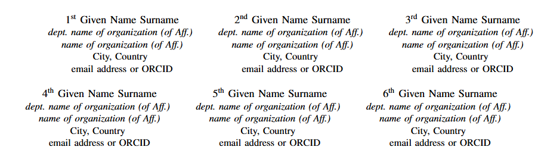
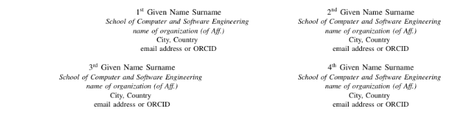
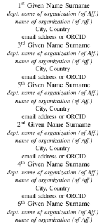
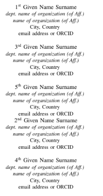
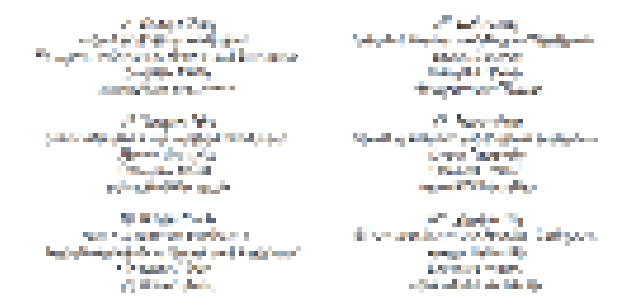

将模板下载下来并直接进行编译，我们都会发现该 latex 模板中作者名字都是没有对齐的：



如果我们的某一行很长的话，这种不对齐的现象会更显眼：



**这种情况的解决办法如下（以6位作者为例）**：

**Step 1：** 将作者顺序按照 `135 246` 进行排列，并将 `\and` 给删除。

模板中的作者排列方式为 `123 456`，如下：

```latex
\author{
\IEEEauthorblockN{1\textsuperscript{st} Given Name Surname}
\IEEEauthorblockA{\textit{dept. name of organization (of Aff.)} \\
\textit{name of organization (of Aff.)}\\
City, Country \\
email address or ORCID}

\and

\IEEEauthorblockN{2\textsuperscript{nd} Given Name Surname}
\IEEEauthorblockA{\textit{dept. name of organization (of Aff.)} \\
\textit{name of organization (of Aff.)}\\
City, Country \\
email address or ORCID}

\and

\IEEEauthorblockN{3\textsuperscript{rd} Given Name Surname}
\IEEEauthorblockA{\textit{dept. name of organization (of Aff.)} \\
\textit{name of organization (of Aff.)}\\
City, Country \\
email address or ORCID}

\and

\IEEEauthorblockN{4\textsuperscript{th} Given Name Surname}
\IEEEauthorblockA{\textit{dept. name of organization (of Aff.)} \\
\textit{name of organization (of Aff.)}\\
City, Country \\
email address or ORCID}

\and

\IEEEauthorblockN{5\textsuperscript{th} Given Name Surname}
\IEEEauthorblockA{\textit{dept. name of organization (of Aff.)} \\
\textit{name of organization (of Aff.)}\\
City, Country \\
email address or ORCID}

\and

\IEEEauthorblockN{6\textsuperscript{th} Given Name Surname}
\IEEEauthorblockA{\textit{dept. name of organization (of Aff.)} \\
\textit{name of organization (of Aff.)}\\
City, Country \\
email address or ORCID}
}

```

我们先给改为 `135 246`的排列顺序，并将 `\and` 删掉后，如下：

```latex
\author{
\IEEEauthorblockN{1\textsuperscript{st} Given Name Surname}
\IEEEauthorblockA{\textit{dept. name of organization (of Aff.)} \\
\textit{name of organization (of Aff.)}\\
City, Country \\
email address or ORCID}

\IEEEauthorblockN{3\textsuperscript{rd} Given Name Surname}
\IEEEauthorblockA{\textit{dept. name of organization (of Aff.)} \\
	\textit{name of organization (of Aff.)}\\
	City, Country \\
	email address or ORCID}

\IEEEauthorblockN{5\textsuperscript{th} Given Name Surname}
\IEEEauthorblockA{\textit{dept. name of organization (of Aff.)} \\
	\textit{name of organization (of Aff.)}\\
	City, Country \\
	email address or ORCID}

\IEEEauthorblockN{2\textsuperscript{nd} Given Name Surname}
\IEEEauthorblockA{\textit{dept. name of organization (of Aff.)} \\
\textit{name of organization (of Aff.)}\\
City, Country \\
email address or ORCID}

\IEEEauthorblockN{4\textsuperscript{th} Given Name Surname}
\IEEEauthorblockA{\textit{dept. name of organization (of Aff.)} \\
\textit{name of organization (of Aff.)}\\
City, Country \\
email address or ORCID}

\IEEEauthorblockN{6\textsuperscript{th} Given Name Surname}
\IEEEauthorblockA{\textit{dept. name of organization (of Aff.)} \\
\textit{name of organization (of Aff.)}\\
City, Country \\
email address or ORCID}
}

```

结束上面一步后，现在编译后长这样：



**Step 2：** 接着分别在 `135` 和 `246` 之间用 `\\` 换行。

```latex
\author{
\IEEEauthorblockN{1\textsuperscript{st} Given Name Surname}
\IEEEauthorblockA{\textit{dept. name of organization (of Aff.)} \\
\textit{name of organization (of Aff.)}\\
City, Country \\
email address or ORCID} \\

\IEEEauthorblockN{3\textsuperscript{rd} Given Name Surname}
\IEEEauthorblockA{\textit{dept. name of organization (of Aff.)} \\
	\textit{name of organization (of Aff.)}\\
	City, Country \\
	email address or ORCID} \\

\IEEEauthorblockN{5\textsuperscript{th} Given Name Surname}
\IEEEauthorblockA{\textit{dept. name of organization (of Aff.)} \\
	\textit{name of organization (of Aff.)}\\
	City, Country \\
	email address or ORCID} 

\IEEEauthorblockN{2\textsuperscript{nd} Given Name Surname}
\IEEEauthorblockA{\textit{dept. name of organization (of Aff.)} \\
\textit{name of organization (of Aff.)}\\
City, Country \\
email address or ORCID} \\

\IEEEauthorblockN{4\textsuperscript{th} Given Name Surname}
\IEEEauthorblockA{\textit{dept. name of organization (of Aff.)} \\
\textit{name of organization (of Aff.)}\\
City, Country \\
email address or ORCID} \\

\IEEEauthorblockN{6\textsuperscript{th} Given Name Surname}
\IEEEauthorblockA{\textit{dept. name of organization (of Aff.)} \\
\textit{name of organization (of Aff.)}\\
City, Country \\
email address or ORCID} 
}
```

加上换行符后编译后长这样：



我们发现加上换行符后，除了 `5` 和 `2` 之间的间距没变，其余的都有了间隔。

**Step 3：** 最后一步，我们在 `5` 和 `2` 之间加上 `\and` 即可：

```latex
\author{
\IEEEauthorblockN{1\textsuperscript{st} Given Name Surname}
\IEEEauthorblockA{\textit{dept. name of organization (of Aff.)} \\
\textit{name of organization (of Aff.)}\\
City, Country \\
email address or ORCID} \\

\IEEEauthorblockN{3\textsuperscript{rd} Given Name Surname}
\IEEEauthorblockA{\textit{dept. name of organization (of Aff.)} \\
	\textit{name of organization (of Aff.)}\\
	City, Country \\
	email address or ORCID} \\

\IEEEauthorblockN{5\textsuperscript{th} Given Name Surname}
\IEEEauthorblockA{\textit{dept. name of organization (of Aff.)} \\
	\textit{name of organization (of Aff.)}\\
	City, Country \\
	email address or ORCID} 
\and
\IEEEauthorblockN{2\textsuperscript{nd} Given Name Surname}
\IEEEauthorblockA{\textit{dept. name of organization (of Aff.)} \\
\textit{name of organization (of Aff.)}\\
City, Country \\
email address or ORCID} \\

\IEEEauthorblockN{4\textsuperscript{th} Given Name Surname}
\IEEEauthorblockA{\textit{dept. name of organization (of Aff.)} \\
\textit{name of organization (of Aff.)}\\
City, Country \\
email address or ORCID} \\

\IEEEauthorblockN{6\textsuperscript{th} Given Name Surname}
\IEEEauthorblockA{\textit{dept. name of organization (of Aff.)} \\
\textit{name of organization (of Aff.)}\\
City, Country \\
email address or ORCID} 
}

```

