本机：Windows

服务器：Linux

前置要求：

- 本机安装Vscode、ssh（命令行输入ssh检查）
- 打开Vscode时建议使用**管理器员权限**打开，在这之前遇到了一些报错。

## **一、远程连接过程**

- 安装插件remote-ssh

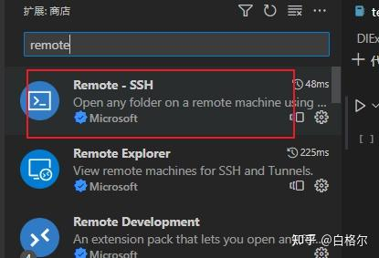

- 点击远程资源管理器、新建远程

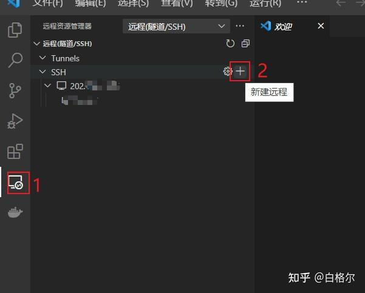

- 在窗口上方弹出的命令框中输入：`ssh name@ip`，`name`是你服务器的用户名，如果没有创建用户则填root，`ip`是你的服务器ip地址

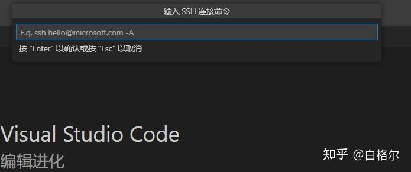

比如我输入`ssh -p 2230 liuwf@202.116.7.104`，其中`-p 2230`表示指定端口号2230，若是没有指定可以直接删除，输入后按回车

- 回车后会弹出选择更新配置文件，点击第一个路径，会自动生成一个config文件

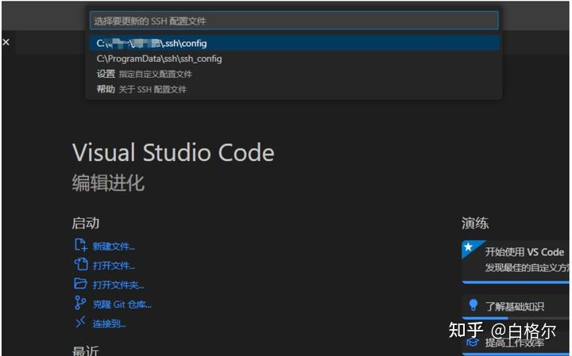

- 下图为config内容，如果没有自动生成，则手动打开并根据自身情况进行配置，文件的位置在上图的路径。

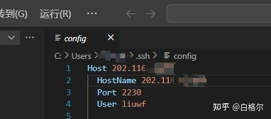

***Host:** 这是一个用户定义的别名，用于指代远程主机。可以在在终端中执行 `ssh 别名` 替代`ssh name@ip`。*

***HostName:** 指定远程主机的实际地址或主机名。*

***Port:** 指定 SSH 连接使用的端口号。*

***User:** 指定连接到远程主机时使用的用户名。在这里，用户名是 `liuwf`。*

- 在 config 文件配置完成并保存后，在VSCode的远程资源管理器中已经出现刚配置的远程服务器，此时点击红框按钮连接即可

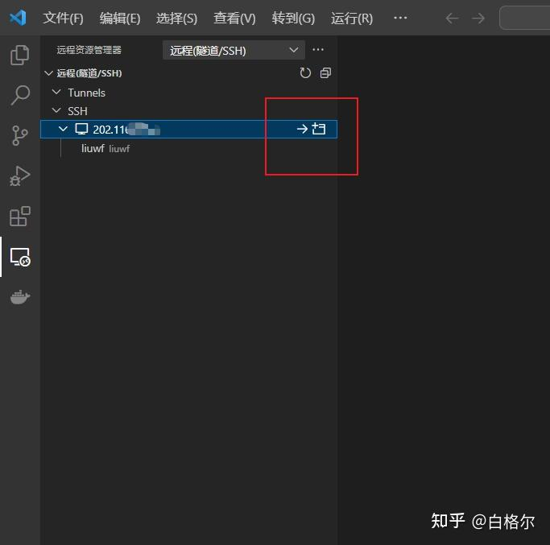

- VSCode会自动进行远程端的设置，窗口上方的中间位置会出现选择平台、输入密码设置，按照自己的情况填写即可。

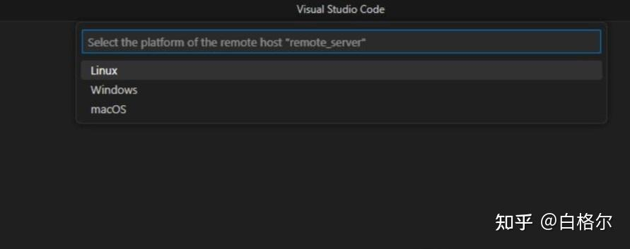

- 此时没有意外的话就可以连接上了远程服务器了

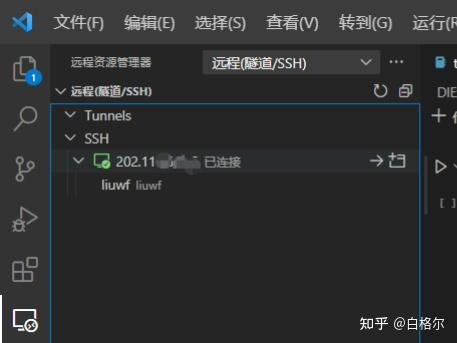

- 连接过程中，我遇到了如下错误：
  `Bad owner or permissions on C:\\Users\.ssh`
  `\> /config`
  `\> 过程试图写入的管道不存在。`

参考了[链接](https://link.zhihu.com/?target=https%3A//blog.csdn.net/qq_46276946/article/details/131299973)仍然不能解决。最后通过使用**管理员权限**打开VSCode解决该问题。

## **二、如何免密连接**

每次连接都需要输入密码未免有些麻烦，一台机器想要免密访问其他机器，需要把自己的公钥内容发送到别的机器的authorized_keys中去，并在本机config文件中配置私钥文件位置。如下为流程。

### 1. 生成新的密钥对

使用命令`ssh-keygen`生成新的密钥对。你可以选择在生成密钥对时为其指定不同的文件名。请注意，`-f` 后的`id_rsa_linux` 和 `id_rsa_windows` 只是示例文件名，你可以根据需要选择其他文件名。

```powershell
 # 在 Linux 和 Mac 上
 ssh-keygen -t rsa -b 2048 -f ~/.ssh/id_rsa_linux

 # 在 Windows 上
 ssh-keygen -t rsa -b 2048 -f C:\Users\Administrator\.ssh\id_rsa_windows

 # 如果你只有单平台使用 ssh
 ssh-keygen
```

**注意：**当你在多个平台上使用 SSH 连接到不同的远程服务器时，可能需要为每个平台生成和使用不同的密钥对。这是因为每个平台（例如，Windows、Linux、Mac）可能有不同的文件系统和密钥文件位置，同时在安全性的考虑下，不同平台上的密钥对最好是独立的。

输入命令后一路回车

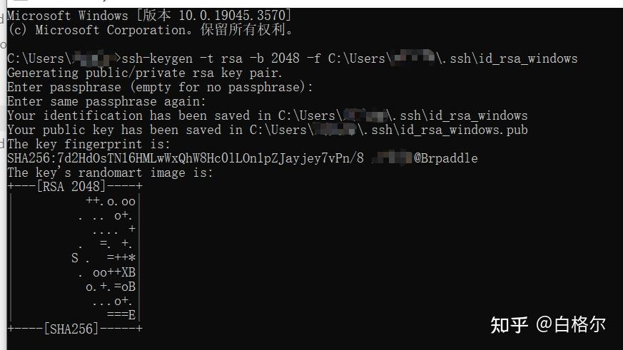

系统会在你指定的路径（本例子为` C:\Users\YourUsername\.ssh`）下生成两个文件，分别是`id_rsa_windows.pub`和`id_rsa_windows`，前者为生成的公钥，后者为私钥 。

### 2. **添加公钥到远程服务器**

将生成的公钥（ `id_rsa_windows.pub`的内容）添加到你远程服务器的 `authorized_keys` 文件中，以允许连接。

(1). 若你本机是**Windows**，可以使用以下方法之一：

- 使用 `scp` 命令**：**使用 `scp` 命令将公钥文件传输到远程服务器，在远程服务器上，将公钥内容追加到 `authorized_keys` 文件，但是本人不建议使用scp发送，这样会对自己机器或者对方机器的原有配置造成覆盖或是丢失，存在风险。

- 手动复制：手动复制公钥文件 (`id_rsa_windows.pub`) 的内容，然后登录到远程服务器，并将内容粘贴到 `authorized_keys` 文件。如下是我生成的`id_rsa_windows.pub`文件内容：

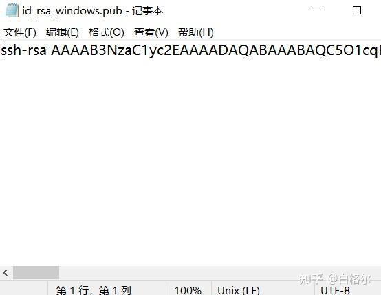

在远程服务器上，`authorized_keys `文件通常存储在用户的 `.ssh `目录中。具体路径可能为 `~/.ssh/authorized_keys`。例如我的用户名是 `liuwf`，那么` authorized_keys` 文件的路径可能是 `/home/liuwf/.ssh/authorized_keys` 。

如果你的`.ssh`目录或者 `authorized_keys` 文件不存在，你可以在服务器终端使用以下命令创建它：

```text
 # 创建目录
 mkdir ~/.ssh
 # 进入目录
 cd ~/.ssh
 # 创建 authorized_keys 文件
 touch authorized_keys
 # 使用文本编辑器打开 authorized_keys 文件，并将你的公钥内容粘贴到其中
 nano authorized_keys
 # 保存并关闭文本编辑器。
```

不熟练使用终端，也可以使用VSCode的资源管理器直接创建，粘贴公钥后保存。

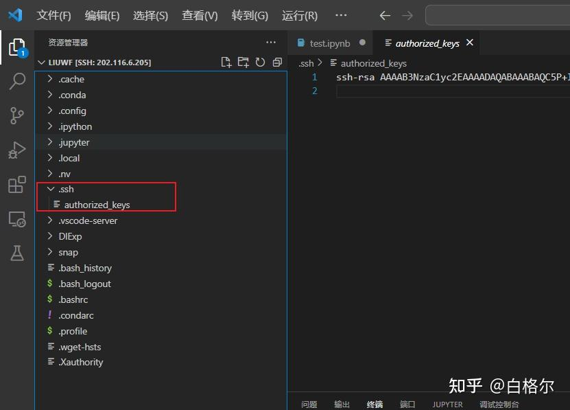

(2). 如果你本机是**Linux**：

`ssh-copy-id` 命令通常用于将你的公钥复制到远程服务器的 `authorized_keys` 文件中。`-i` 选项用于指定身份文件（即你的公钥文件）。在本机执行如下命令：

```text
 ssh-copy-id -i id_rsa_Windows.pub name@ip
```

确保公钥文件 (`id_rsa_Windows.pub`) 在本地机器上的正确位置，并且你有读取该密钥的权限。同时，确保远程服务器上的用户 有一个 `.ssh` 目录，并且 `authorized_keys` 文件有正确的权限（通常是目录权限为 `700`，`authorized_keys` 文件权限为 `600`）。

然后将你的公钥 (`id_rsa_Windows.pub`) 的内容复制并追加到远程服务器的 `authorized_keys` 文件中。

### 3. **配置 SSH 客户端：**

将添加公钥到远程服务器后，最后一步便是配置你的主机。

打开你的 SSH 客户端（本机）配置文件（也就是前面生成的config文件，一般在`C:\Users\YourUsername\.ssh\config`），添加配置（`IdentityFile` **私钥**文件路径），以指定使用哪个私钥文件。下图红框为我添加的内容。

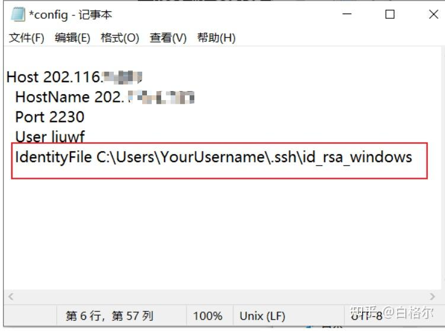

这样，当你使用 ssh 连接服务器时，SSH 客户端将自动选择相应的私钥文件，就可以实现免密登录了。
