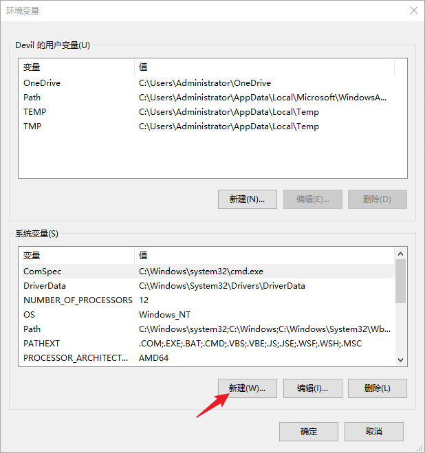
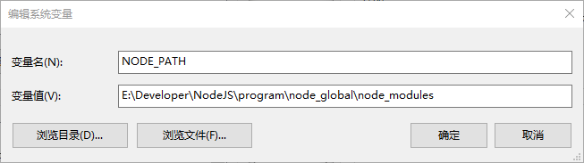
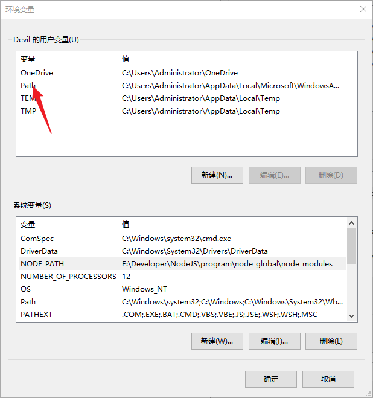
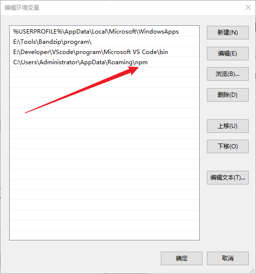

[Nodejs安装零基础教程2025_哔哩哔哩_bilibili](https://www.bilibili.com/video/BV1sbjgzwEBX/?spm_id_from=333.337.search-card.all.click&vd_source=0fdb2f4228bec4b8b16890348211971f)


---


# 安装

基本一直next就行，主要是后续环境变量配置和路径修改


---


# 配置

在安装路径新建**node_global**和**node_cache**文件夹，终端输入

```
npm config set prefix "安装路径\node_global"
npm config set cache "安装路径\node_cache"
```

输入下列指令检查配置是否成功

```
npm config get prefix
npm config get cache
```

下面配置环境变量

1. 

2. 

   ```
   NODE_PATH
   E:\Developer\NodeJS\program\node_global\node_modules
   ```

3. 
   替换下面这个用户path为node_global路径--E:\Developer\NodeJS\program\node_global
   

4. 点击系统变量的path，新建变量%NODE_PATH%

5. 配置完成

6. 验证

   ```
   npm install express -g
   ```
